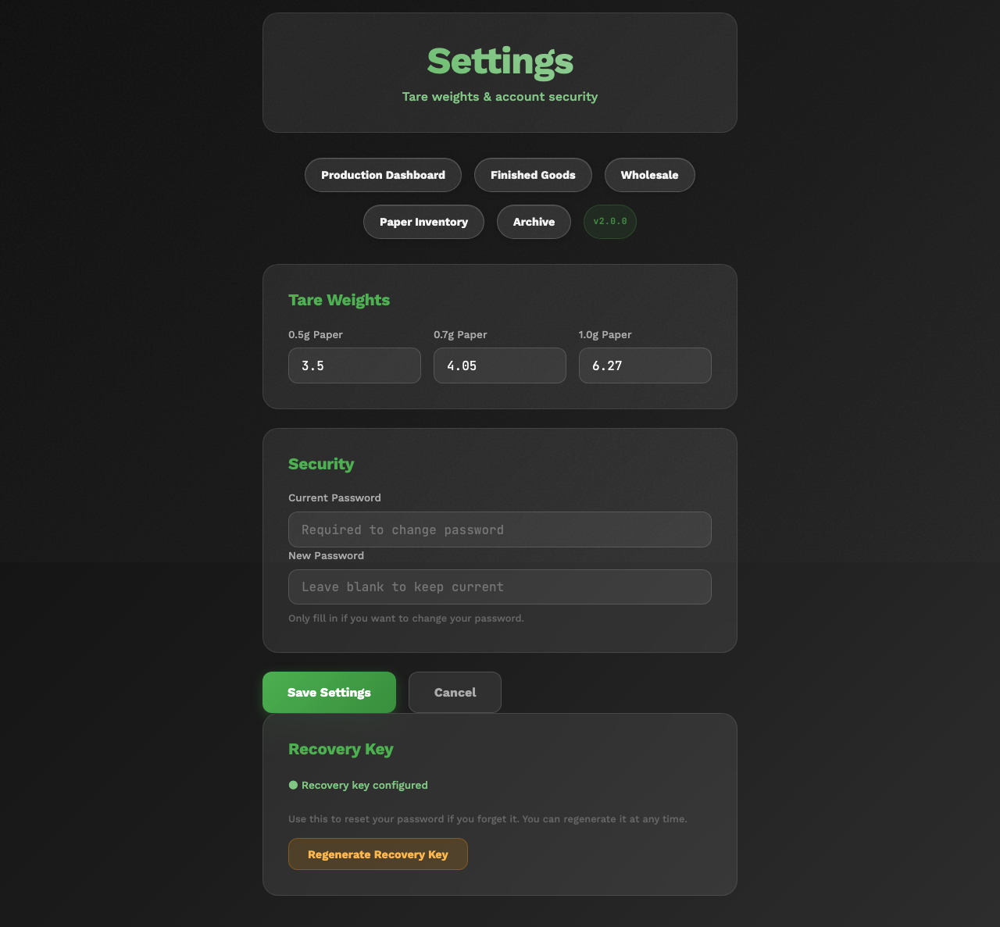

# Configuration Guide

## Overview

This guide provides a complete reference for every configuration option in both PreRollTracker and ApexAPI. PreRollTracker is configured primarily through environment variables in a `.env` file and application settings stored in the database. ApexAPI is configured through a single JSON file (`apex_config.json`).

Changing configuration values does not require writing code. For PreRollTracker, most changes require editing the `.env` file and restarting the service. For ApexAPI, most changes require editing `apex_config.json` and restarting the application.

---

## 1. PreRollTracker Environment Variables

PreRollTracker reads its environment from a `.env` file located in the application root directory (typically `/opt/preroll-tracker/.env`). The `python-dotenv` library loads this file automatically when the application starts.

### 1.1 Complete Environment Variable Reference

| Variable | Required | Default | Description |
|---|---|---|---|
| `SECRET_KEY` | Yes | None (app refuses to start without it) | Cryptographic key used for session signing, CSRF tokens, and other security features. Must be a long random string. Generate with: `python3 -c "import secrets; print(secrets.token_hex(32))"` |
| `ADMIN_PASSWORD_HASH` | Yes | None | bcrypt hash of the admin password. Generated by `setup_password_standalone.py` or the settings page. Never store the plain-text password here. |
| `FLASK_ENV` | Recommended | `development` | Set to `production` for live deployment. Controls session cookie security (Secure flag), logging behavior, and debug mode. |
| `SENTRY_DSN` | Optional | Empty string (Sentry disabled) | Sentry Data Source Name for error tracking. Obtain from your Sentry project settings. Leave empty to disable Sentry. |
| `SENTRY_ENV` | Optional | `production` | Sentry environment tag. Useful if you run staging and production instances. |
| `BACKUP_ENCRYPTION_KEY` | Required for remote backups | Empty string | Passphrase used to encrypt database backups with AES-256-CBC. Must be a long, random string. If not set, remote (GitHub) backups will fail. |
| `GITHUB_REPO` | Required for remote backups | Empty string | GitHub repository in `owner/repo` format for uploading encrypted backups as pre-releases. Requires the `gh` CLI to be installed and authenticated. |
| `PUSHOVER_APP_TOKEN` | Optional | Empty string | Pushover application token for sending failure notifications. Used as a fallback if the app token is not configured in the database settings. |
| `LOG_LEVEL` | Optional | `INFO` | Logging level. Options: `DEBUG`, `INFO`, `WARNING`, `ERROR`, `CRITICAL`. |

### 1.2 Example `.env` File

```
FLASK_ENV=production
SECRET_KEY=a1b2c3d4e5f6a1b2c3d4e5f6a1b2c3d4e5f6a1b2c3d4e5f6a1b2c3d4e5f6a1b2
ADMIN_PASSWORD_HASH=$2b$12$XXXXXXXXXXXXXXXXXXXXXXXXXXXXXXXXXXXXXXXXXXXXXXXXXXXXX
SENTRY_DSN=https://examplePublicKey@o0.ingest.sentry.io/0
SENTRY_ENV=production
BACKUP_ENCRYPTION_KEY=my-very-long-and-random-encryption-passphrase-here
GITHUB_REPO=mycompany/preroll-tracker
PUSHOVER_APP_TOKEN=aXXXXXXXXXXXXXXXXXXXXXXXXXXXXXX
LOG_LEVEL=INFO
```

### 1.3 Generating a SECRET_KEY

The `SECRET_KEY` is the most critical environment variable. It must be:

- At least 32 characters long.
- Randomly generated (do not use dictionary words or predictable patterns).
- Unique to each installation.
- Never shared or committed to version control.

Generate a secure key:

```
python3 -c "import secrets; print(secrets.token_hex(32))"
```

If the `SECRET_KEY` changes, all active sessions are invalidated (users are logged out) and all CSRF tokens become invalid.

---

## 2. PreRollTracker Application Settings

Beyond environment variables, PreRollTracker stores operational settings in the `settings` table of the SQLite database. These settings are managed through the admin dashboard's Settings page.

### 2.1 Production Settings

| Setting | Type | Default | Description |
|---|---|---|---|
| Tare weight (0.5g) | Decimal | Configured per batch | Weight of the empty cone for 0.5g pre-rolls, used in yield calculations |
| Tare weight (0.7g) | Decimal | Configured per batch | Weight of the empty cone for 0.7g pre-rolls |
| Tare weight (1.0g) | Decimal | Configured per batch | Weight of the empty cone for 1.0g pre-rolls |
| Papers per box (0.5g) | Integer | 1000 | Number of papers/cones in a box for 0.5g size |
| Papers per box (0.7g) | Integer | 900 | Number of papers/cones in a box for 0.7g size |
| Papers per box (1.0g) | Integer | 1000 | Number of papers/cones in a box for 1.0g size |

### 2.2 Work Schedule Settings

| Setting | Type | Default | Description |
|---|---|---|---|
| Work hours start | Integer (0-23) | 9 | Start of the work day (used for production rate calculations) |
| Work hours end | Integer (0-23) | 17 | End of the work day |
| Work days | List of integers | [1,2,3,4,5] (Mon-Fri) | Days of the week when production occurs (1=Monday) |

### 2.3 Inventory Alert Settings

| Setting | Type | Default | Description |
|---|---|---|---|
| Alert threshold (0.5g) | Integer | 5 boxes | Number of remaining boxes that triggers a low inventory alert |
| Alert threshold (0.7g) | Integer | 3 boxes | Same for 0.7g cones |
| Alert threshold (1.0g) | Integer | 3 boxes | Same for 1.0g cones |

### 2.4 Pushover Notification Settings (Database)

These are stored in the database and configured through the Settings page:

| Setting | Type | Default | Description |
|---|---|---|---|
| Enabled | Boolean | False | Master switch for Pushover notifications |
| User Key | String | Empty | Your Pushover user key (from your Pushover account) |
| App Token | String | From `PUSHOVER_APP_TOKEN` env var | Pushover application token |
| Warning grams | Integer | 500 | Finished goods gram level that triggers a warning notification |
| Critical grams | Integer | 50 | Gram level that triggers a critical notification |
| Cooldown hours | Integer | 24 | Minimum hours between repeated notifications for the same package |



---

## 3. ApexAPI Configuration (apex_config.json)

ApexAPI stores all of its configuration in a single JSON file: `apex_config.json`. This file is located in the application's root directory (next to the `.exe` on Windows, or in the project root during development).

### 3.1 Complete Configuration Reference

#### General Settings

| Key | Type | Default | Description |
|---|---|---|---|
| `license_number` | String | `""` | Cannabis license number (for display and compliance) |
| `selected_printer` | String | `""` | Name of the default printer for order forms |
| `window_geometry` | String | `"1400x900"` | Window size on startup (width x height in pixels) |
| `window_state` | String | `"normal"` | Window state: `"normal"` or `"maximized"` |
| `ui_theme` | String | `"light"` | UI theme: `"light"` or `"dark"` |
| `log_level` | String | `"INFO"` | Logging level: `DEBUG`, `INFO`, `WARNING`, `ERROR` |

#### API Connection Settings

| Key | Type | Default | Description |
|---|---|---|---|
| `api_token` | String | `""` | Apex Trading API bearer token. Obtain from your Apex Trading account. Format: `"130-xEkX..."` (number, pipe, token string) |
| `dashboard_api_key` | String | `""` | PreRollTracker Dashboard API key. Copy from PreRollTracker Settings page. |
| `api_timeout` | Integer | `30` | HTTP request timeout in seconds for API calls |
| `print_timeout` | Integer | `60` | Timeout in seconds for print operations |
| `max_cache_size` | Integer | `1000` | Maximum number of entries in the in-memory LRU cache |

#### Auto-Refresh Settings

| Key | Type | Default | Description |
|---|---|---|---|
| `auto_refresh_enabled` | Boolean | `true` | Whether to automatically refresh order data |
| `auto_refresh_interval` | Integer | `5` | Seconds between automatic refreshes |
| `offer_startup_print` | Boolean | `true` | Whether to offer printing unprinted orders on startup |

#### Order Filtering Settings

| Key | Type | Default | Description |
|---|---|---|---|
| `excluded_statuses` | List | `["Complete", "Cancelled", "Delivered"]` | Order statuses to hide from the active order list |
| `excluded_products` | List | `["3rd Party Products - 3rd Party Products"]` | Product names to exclude from order forms |
| `include_3rd_party_products` | Boolean | `false` | Whether to include third-party products in order processing |
| `last_filter_value` | String | `""` | Remembered filter text from the last session |

#### API Timestamp Tracking

| Key | Type | Default | Description |
|---|---|---|---|
| `api_last_call_timestamps` | Object | `{}` | Tracks the last API call time per endpoint for `updated_at_from` compliance. Managed automatically. |
| `api_initial_sync_date` | String | `"2025-07-01T00:00:00Z"` | The earliest date to sync data from on first run. Orders before this date are ignored. |

#### Cache Directory

| Key | Type | Default | Description |
|---|---|---|---|
| `cache_directory` | String | `"cache"` | Directory for file-based API response caching (relative to application root) |

#### Column Widths

| Key | Type | Default | Description |
|---|---|---|---|
| `column_widths` | Object | `{}` | Saved column widths for the order table. Managed automatically as the user resizes columns. |

---

## 4. Cache Warming Strategies and Tuning

### 4.1 What Is Cache Warming?

Cache warming is a proactive caching strategy where ApexAPI pre-fetches API data in the background before it is requested by the user. This makes the application feel faster because data is already available in the cache when needed.

### 4.2 Cache Warming Configuration

The `cache_warming` section of `apex_config.json` controls this behavior:

```json
"cache_warming": {
    "enabled": true,
    "strategies": {
        "orders_list": {
            "enabled": true,
            "interval_minutes": 2,
            "run_on_startup": true
        },
        "predictive_details": {
            "enabled": true,
            "interval_minutes": 5,
            "run_on_startup": false
        },
        "inventory": {
            "enabled": true,
            "interval_minutes": 1440,
            "run_on_startup": true
        },
        "order_details": {
            "enabled": true,
            "interval_minutes": 30,
            "run_on_startup": false
        },
        "third_party_status": {
            "enabled": false,
            "interval_minutes": 240,
            "run_on_startup": false
        }
    }
}
```

### 4.3 Strategy Reference

| Strategy | What It Caches | Default Interval | Run on Startup | Notes |
|---|---|---|---|---|
| `orders_list` | Active order list from Apex Trading | 2 minutes | Yes | Most frequently refreshed; keeps the order table current |
| `predictive_details` | Order details for orders likely to be viewed | 5 minutes | No | Pre-fetches details for recently updated orders |
| `inventory` | Full product inventory from Apex Trading | 1440 min (24 hr) | Yes | Large data set; refreshed daily |
| `order_details` | Individual order detail pages | 30 minutes | No | Caches details for all visible orders |
| `third_party_status` | Third-party product order statuses | 240 min (4 hr) | No | Disabled by default; enable only if using third-party products |

### 4.4 Tuning Recommendations

- **If the application feels slow:** Enable all strategies and reduce intervals. Set `orders_list` to 1 minute.
- **If API rate limits are a concern:** Increase intervals or disable `predictive_details` and `order_details`.
- **If startup is slow:** Set `run_on_startup` to `false` for `inventory` (it is the largest fetch).
- **If memory usage is high:** Reduce `max_cache_size` from 1000 to 500.

### 4.5 Cache Logging

The `cache_logging` section controls diagnostic output for cache operations:

```json
"cache_logging": {
    "enabled": true,
    "console_enabled": true,
    "file_enabled": true,
    "stats_interval_minutes": 5
}
```

| Key | Type | Default | Description |
|---|---|---|---|
| `enabled` | Boolean | `true` | Master switch for cache logging |
| `console_enabled` | Boolean | `true` | Print cache stats to the console/terminal |
| `file_enabled` | Boolean | `true` | Write cache stats to the log file |
| `stats_interval_minutes` | Integer | `5` | How often to print cache hit/miss statistics |

Set `enabled` to `false` to silence all cache-related log output.

---

## 5. Batch Inventory Sync Configuration

### 5.1 What Is Batch Inventory Sync?

Batch inventory sync is a background process in ApexAPI that keeps Apex Trading's batch inventory in sync with the pre-roll production data in PreRollTracker. When pre-rolls are packed, the dashboard tracks grams consumed. This sync service updates the corresponding Apex Trading batch quantities to match.

### 5.2 Configuration

The `batch_inventory_sync` section of `apex_config.json`:

```json
"batch_inventory_sync": {
    "enabled": true,
    "poll_interval_seconds": 5,
    "min_api_interval_seconds": 10,
    "skip_if_no_change": true,
    "auto_start": true
}
```

| Key | Type | Default | Description |
|---|---|---|---|
| `enabled` | Boolean | `true` | Master switch for inventory sync |
| `poll_interval_seconds` | Integer | `5` | How often to check for changes (seconds). Cache makes each check fast (~2 seconds). |
| `min_api_interval_seconds` | Integer | `10` | Minimum time between actual API calls to Apex Trading (rate limiting) |
| `skip_if_no_change` | Boolean | `true` | Skip API calls if no order changes detected since last sync |
| `auto_start` | Boolean | `true` | Start sync automatically when the application launches |

### 5.3 Tuning the Sync

- **For faster sync:** Reduce `poll_interval_seconds` to 3 and `min_api_interval_seconds` to 5. This updates Apex inventory within seconds of packing changes.
- **For lower API usage:** Increase `poll_interval_seconds` to 60 and `min_api_interval_seconds` to 120.
- **To disable sync:** Set `enabled` to `false`. Apex Trading inventory will not be updated automatically.

---

## 6. Push Notification Setup (Pushover)

### 6.1 What Pushover Does

PreRollTracker can send push notifications to your phone when:

- A backup fails.
- Finished goods inventory drops below warning or critical thresholds.

Notifications are sent via the Pushover service (https://pushover.net).

### 6.2 Setup Steps

1. **Create a Pushover account** at https://pushover.net and install the Pushover app on your phone.
2. **Get your User Key** from the Pushover dashboard. It looks like a 30-character alphanumeric string.
3. **Create an Application** in Pushover to get an App Token. Name it something like "PreRollTracker".
4. **Configure PreRollTracker:**
   - **Option A (Environment variable):** Add `PUSHOVER_APP_TOKEN=your-app-token` to the `.env` file.
   - **Option B (Settings page):** Enter the App Token and User Key in the Pushover section of the Settings page.
5. **Enable notifications** by toggling the "Enabled" switch on the Settings page.
6. **Set thresholds:**
   - Warning grams: The gram level that triggers a warning (default: 500g).
   - Critical grams: The gram level that triggers a critical alert (default: 50g).
   - Cooldown hours: Minimum time between repeated alerts for the same package (default: 24 hours).
7. **Test the configuration** by triggering a manual backup failure or checking a finished goods package near the threshold.


### 6.3 Backup Failure Notifications

Backup failure notifications use priority level 1 (high priority) in Pushover, which means they will sound an alert even if your phone is in quiet mode (depending on your Pushover settings).

The notification message includes the first 200 characters of the error message to help you diagnose the problem quickly.

---

## 7. Sentry Error Tracking Setup

### 7.1 What Sentry Does

Sentry captures unhandled exceptions, performance traces, and profiles from the running application. It groups similar errors together, tracks error frequency, and sends alerts when new issues appear.

### 7.2 Setup Steps

1. **Create a Sentry account** at https://sentry.io (or use a self-hosted Sentry instance).
2. **Create a new project** in Sentry. Choose "Flask" as the platform.
3. **Copy the DSN** from the project settings. It looks like: `https://publickey@o0.ingest.sentry.io/0`
4. **Add to `.env`:**
   ```
   SENTRY_DSN=https://publickey@o0.ingest.sentry.io/0
   SENTRY_ENV=production
   ```
5. **Restart the application:**
   ```
   sudo systemctl restart preroll-tracker
   ```
6. **Verify:** Trigger a test error or check the Sentry dashboard for the startup event.

### 7.3 Sentry Configuration Details

The Sentry integration is configured in `app.py` with these settings:

| Setting | Value | Description |
|---|---|---|
| `release` | `pre-roll-tracker@{git_sha}` | Links errors to specific code versions |
| `traces_sample_rate` | `0.05` (5%) | Percentage of requests that generate performance traces |
| `profiles_sample_rate` | `0.05` (5%) | Percentage of requests that generate CPU profiles |
| `send_default_pii` | `False` | Never sends personally identifiable information |
| `before_send` filter | Active | Drops ConnectionReset, BrokenPipe, and Timeout errors |

### 7.4 Disabling Sentry

To disable Sentry, remove the `SENTRY_DSN` variable from the `.env` file (or set it to an empty string) and restart the application.

---

## 8. Pre-Roll Packing List Settings (ApexAPI)

The `pre_roll_packing_list` section of `apex_config.json` controls packing list behavior:

```json
"pre_roll_packing_list": {
    "auto_refresh_enabled": true,
    "auto_refresh_interval": 60,
    "auto_export_enabled": false,
    "auto_export_path": "",
    "default_view": "by_store",
    "default_filter": "active",
    "delivery_tracker_enabled": false,
    "delivery_sheet_path": "",
    "history_excel_path": ""
}
```

| Key | Type | Default | Description |
|---|---|---|---|
| `auto_refresh_enabled` | Boolean | `true` | Auto-refresh the packing list view |
| `auto_refresh_interval` | Integer | `60` | Seconds between refreshes |
| `auto_export_enabled` | Boolean | `false` | Automatically export packing data to Excel |
| `auto_export_path` | String | `""` | File path for auto-exported Excel file |
| `default_view` | String | `"by_store"` | Default grouping: `"by_store"` or `"by_product"` |
| `default_filter` | String | `"active"` | Default filter: `"active"` or `"all"` |
| `delivery_tracker_enabled` | Boolean | `false` | Enable delivery tracking integration |
| `delivery_sheet_path` | String | `""` | Path to the delivery tracking Excel sheet |
| `history_excel_path` | String | `""` | Path to the history archive Excel sheet |

---

## Summary

### PreRollTracker Configuration Quick Reference

| What to Change | Where | Restart Required? |
|---|---|---|
| Admin password | `.env` (ADMIN_PASSWORD_HASH) or Settings page | Yes (for `.env` changes) |
| Session signing key | `.env` (SECRET_KEY) | Yes |
| Error tracking | `.env` (SENTRY_DSN) | Yes |
| Backup encryption | `.env` (BACKUP_ENCRYPTION_KEY) | Yes |
| GitHub backup target | `.env` (GITHUB_REPO) | Yes |
| Push notifications | Settings page (Pushover section) | No |
| Work schedule | Settings page | No |
| Inventory thresholds | Settings page | No |
| Tare weights | Settings page | No |

### ApexAPI Configuration Quick Reference

| What to Change | Where | Restart Required? |
|---|---|---|
| Apex Trading token | `apex_config.json` (api_token) | Yes |
| Dashboard API key | `apex_config.json` (dashboard_api_key) | Yes |
| Cache warming | `apex_config.json` (cache_warming) | Yes |
| Inventory sync | `apex_config.json` (batch_inventory_sync) | Yes |
| UI theme | `apex_config.json` (ui_theme) | Yes |
| Order filters | `apex_config.json` (excluded_statuses) | Yes |
| Refresh interval | `apex_config.json` (auto_refresh_interval) | Yes |
| Log level | `apex_config.json` (log_level) | Yes |
