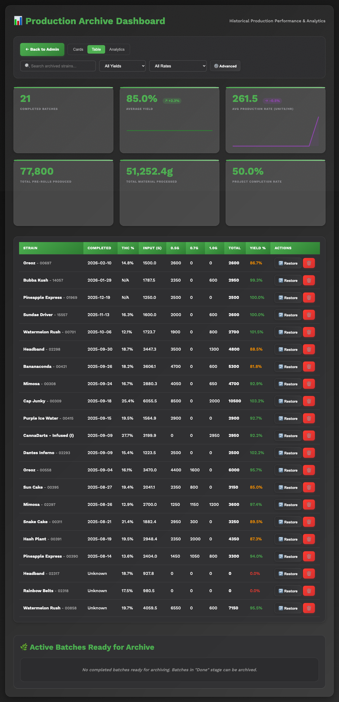

# Data Management Guide

## Overview

This guide explains how data is stored, backed up, restored, and maintained across both PreRollTracker and ApexAPI. Both applications use SQLite databases for persistent storage. PreRollTracker has an automated encrypted backup system that stores copies locally and uploads them to GitHub releases. ApexAPI stores its data locally on the Windows machine where it runs.

Understanding where data lives and how to protect it is critical for smooth operations. This guide walks through database structures, the backup system, restore procedures, data exports, and regular maintenance tasks.

---

## 1. Understanding the SQLite Databases

### 1.1 PreRollTracker Database

**File:** `preroll_tracker.db` (located in the application root directory, typically `/opt/preroll-tracker/`)

PreRollTracker uses SQLite with Write-Ahead Logging (WAL) mode enabled for better concurrent read/write access. The database has a 30-second lock timeout to handle contention between gunicorn workers.

**Core Tables:**

| Table | Purpose | Key Columns |
|---|---|---|
| `batches` | Production batch tracking | `id`, `strain`, `input_grams`, `produced`, `stage`, `archived` |
| `audit_log` | Change tracking and audit trail | `batch`, `strain`, `ts`, `field`, `old`, `new` |
| `finished_goods` | METRC packages in inventory | `metrc_number`, `strain`, `current_grams`, `status` |
| `finished_goods_history` | Historical snapshots of finished goods | Snapshots of inventory state over time |
| `inventory` | Paper/cone inventory by size | `size`, `current_boxes`, `papers_per_box` |
| `inventory_usage` | Daily paper consumption tracking | Daily usage records for forecasting |
| `settings` | Application settings (key-value) | `key`, `value` (JSON-encoded) |
| `wholesale_holds` | Reserved inventory for wholesale | Hold quantities against finished goods |

The `batches` table is the most important. Each row represents one pre-roll production batch and contains dozens of columns tracking everything from grinding status to centrifuge settings to METRC compliance numbers.

**Key columns in the batches table:**

| Column | Type | Description |
|---|---|---|
| `id` | TEXT | Unique batch identifier |
| `strain` | TEXT | Cannabis strain name |
| `input_grams` | REAL | Starting weight in grams |
| `produced` | INTEGER | Number of pre-rolls produced |
| `grams_used` | REAL | Grams of material consumed |
| `stage` | INTEGER | Production stage (0-7, from "Not ground" to "Done") |
| `archived` | INTEGER | 0 = active, 1 = archived |
| `origin_metrc_number` | TEXT | Source METRC package number |
| `harvest_date` | TEXT | Harvest date of the source material |
| `thc_percent` | REAL | THC potency percentage |

[SCREENSHOT: SQLite browser showing the batches table with several rows of production data]

### 1.2 ApexAPI Database

**File:** `apex_data.db` (located in the ApexAPI installation directory)

ApexAPI stores order data, cache state, and sync tracking in its own SQLite database. This database is populated from the Apex Trading API and the PreRollTracker Dashboard API.

The database contains 13 tables covering orders, products, inventory cache, batch mappings, and sync state. The most important tables are:

| Table | Purpose |
|---|---|
| Orders | Cached Apex Trading orders |
| Order Items | Line items within orders |
| Products | Product catalog from Apex |
| Batch Mappings | Strain-to-batch-ID mappings for inventory sync |
| Sync State | Tracks last sync timestamps and states |

**Important:** The ApexAPI database is a **cache** of data from external APIs. If it is lost or corrupted, it can be rebuilt by re-syncing from Apex Trading and PreRollTracker. No unique data originates in this database.

### 1.3 Additional Data Files

**PreRollTracker also maintains several JSON files for legacy compatibility and ancillary data:**

| File | Location | Purpose |
|---|---|---|
| `.env` | Application root | Environment variables (credentials, keys) |
| `data/settings.json` | `data/` directory | Application settings (legacy, now mostly in DB) |
| `data/audit.json` | `data/` directory | Legacy audit log format |
| `data/inventory.json` | `data/` directory | Legacy inventory data |
| `dismissed_alerts.json` | Application root | Tracks which alerts have been dismissed |

**ApexAPI data files:**

| File | Location | Purpose |
|---|---|---|
| `apex_config.json` | Application root | All configuration settings |
| `inventory_cache.json` | Application root | Cached Apex inventory data |
| `printed_orders.json` | Application root | Tracks which orders have been printed |
| `third_party_orders_cache.json` | Application root | Cached third-party order status |
| `cache/` directory | `cache/` | File-based cache for API responses |

---

## 2. Backup System Overview

### 2.1 How Backups Work

PreRollTracker has a fully automated backup system that runs as a background thread inside the application. One gunicorn worker is elected as the backup worker using a filesystem lock to prevent duplicate runs.

**Backup cycle (runs every 6 hours):**

1. **Wait for startup:** A 60-second delay after application start prevents backup contention during deployment.
2. **Acquire lock:** Only one gunicorn worker acquires the filesystem lock at `/opt/preroll-tracker/backups/.backup.lock`.
3. **Local backup:** The SQLite database is copied using SQLite's backup API (safe for concurrent access). A timestamped copy of the `.env` file is also created.
4. **Encryption:** The database backup is encrypted with AES-256-CBC using the `BACKUP_ENCRYPTION_KEY` environment variable. Encryption uses OpenSSL with PBKDF2 key derivation.
5. **GitHub upload:** The encrypted file is uploaded as a GitHub pre-release using the `gh` CLI tool, tagged as `backup/YYYYMMDD_HHMMSS`.
6. **Cleanup:** Old local backups are pruned to keep the most recent 10. Old GitHub releases are pruned to keep the most recent 30.
7. **Metadata:** A record is written to `backups/backup_metadata.json` with timestamps, sizes, and status.
8. **Failure notification:** If any step fails, a Pushover notification is sent (if configured).

### 2.2 Backup Retention

| Storage | Retention | Location |
|---|---|---|
| Local (unencrypted) | Last 10 backups | `backups/` directory |
| Local `.env` copies | Last 10 copies | `backups/` directory |
| Remote (encrypted) | Last 30 backups | GitHub releases |
| Backup metadata | Last 30 records | `backups/backup_metadata.json` |

### 2.3 Required Environment Variables

The backup system requires these variables in the `.env` file:

| Variable | Required For | Example |
|---|---|---|
| `BACKUP_ENCRYPTION_KEY` | Encrypting backups | A long random string (32+ characters) |
| `GITHUB_REPO` | Uploading to GitHub | `username/preroll-tracker` |

If `GITHUB_REPO` is not set, only local backups are created. If `BACKUP_ENCRYPTION_KEY` is not set, remote backups will fail (local backups still succeed).

---

## 3. How to Manually Trigger and Verify a Backup

### 3.1 Triggering a Manual Backup

**Method 1: Using the management script**

```
cd /opt/preroll-tracker
source venv/bin/activate
python3 manage.py backup
```

**Method 2: Using Python directly**

```
cd /opt/preroll-tracker
source venv/bin/activate
python3 -c "from backup_manager import BackupManager; bm = BackupManager(); print(bm.run_full_backup_cycle())"
```

### 3.2 Verifying Backup Status

**Check the API endpoint:**

```
curl https://himomstats.online/api/backup-status
```

**Expected successful response:**

```json
{
  "last_backup_time": "20260228_060000",
  "last_backup_size_bytes": 524288,
  "local_backup_count": 8,
  "remote_backup_count": 25,
  "last_remote_tag": "backup/20260228_060000",
  "last_status": "success",
  "last_error": null
}
```

**Check local backup files:**

```
ls -la /opt/preroll-tracker/backups/preroll_tracker.db.backup_*
```

**Check GitHub releases:**

```
gh release list --repo your-username/preroll-tracker --limit 10
```

### 3.3 Troubleshooting Backup Failures

If `last_status` shows `failed`:

1. Check `last_error` in the backup status response for the error message.
2. Check application logs: `sudo journalctl -u preroll-tracker | grep -i backup`
3. Verify environment variables are set: `grep BACKUP /opt/preroll-tracker/.env`
4. Verify the `gh` CLI is installed and authenticated: `gh auth status`
5. Verify OpenSSL is installed: `openssl version`

---

## 4. Restoring from Backup

### 4.1 Restoring from a Local Backup

Local backups are unencrypted SQLite database copies.

1. Stop the application:
   ```
   sudo systemctl stop preroll-tracker
   ```
2. List available local backups:
   ```
   ls -lt /opt/preroll-tracker/backups/preroll_tracker.db.backup_*
   ```
3. Copy the desired backup over the current database:
   ```
   cp /opt/preroll-tracker/backups/preroll_tracker.db.backup_20260228_060000 /opt/preroll-tracker/preroll_tracker.db
   ```
4. Start the application:
   ```
   sudo systemctl start preroll-tracker
   ```
5. Verify the application is working:
   ```
   curl https://himomstats.online/api/overview
   ```

### 4.2 Restoring from an Encrypted Remote Backup

Remote backups on GitHub are encrypted with AES-256-CBC. You need the `BACKUP_ENCRYPTION_KEY` to decrypt them.

1. Stop the application:
   ```
   sudo systemctl stop preroll-tracker
   ```
2. Download the encrypted backup from GitHub:
   ```
   gh release download backup/20260228_060000 --repo your-username/preroll-tracker --dir /tmp/restore/
   ```
3. Decrypt the backup using OpenSSL:
   ```
   openssl enc -d -aes-256-cbc -pbkdf2 \
       -in /tmp/restore/preroll_tracker.db.backup_20260228_060000.enc \
       -out /opt/preroll-tracker/preroll_tracker.db \
       -pass pass:"$BACKUP_ENCRYPTION_KEY"
   ```
   Replace `$BACKUP_ENCRYPTION_KEY` with the actual encryption key from your `.env` file.
4. Set correct permissions:
   ```
   chown $USER:$USER /opt/preroll-tracker/preroll_tracker.db
   ```
5. Start the application:
   ```
   sudo systemctl start preroll-tracker
   ```

### 4.3 Restoring the `.env` File

If you lose the `.env` file, local copies are stored in the backups directory:

```
ls -lt /opt/preroll-tracker/backups/.env.backup_*
```

Copy the most recent one:

```
cp /opt/preroll-tracker/backups/.env.backup_20260228_060000 /opt/preroll-tracker/.env
chmod 600 /opt/preroll-tracker/.env
```

**Critical:** If you lose both the `.env` file and all backup copies, you will need to recreate it from scratch. The most critical variables are `SECRET_KEY`, `ADMIN_PASSWORD_HASH`, and `BACKUP_ENCRYPTION_KEY`.

---

## 5. Data Exports

### 5.1 Audit Log Export

The audit log tracks every change made to batches and inventory. To export it:

**From the database directly:**

```
sqlite3 -header -csv /opt/preroll-tracker/preroll_tracker.db \
  "SELECT ts, batch, strain, field, old, new FROM audit_log ORDER BY ts DESC;" \
  > audit_export.csv
```

**From the API:**

```
curl -H "X-API-Key: YOUR_KEY" https://himomstats.online/api/audit-log > audit_log.json
```

### 5.2 Production History Export

To export all batch data (active and archived):

```
sqlite3 -header -csv /opt/preroll-tracker/preroll_tracker.db \
  "SELECT id, strain, input_grams, produced, grams_used, stage, archived, harvest_date, thc_percent, production_start_time, production_end_time FROM batches ORDER BY production_start_time DESC;" \
  > production_history.csv
```

### 5.3 Finished Goods Export

To export METRC finished goods inventory:

```
sqlite3 -header -csv /opt/preroll-tracker/preroll_tracker.db \
  "SELECT metrc_number, strain, initial_grams, current_grams, status, grams_ordered, grams_packed, grams_packed_lifetime FROM finished_goods ORDER BY strain;" \
  > finished_goods.csv
```

### 5.4 Inventory Usage Export

To export paper/cone consumption history:

```
sqlite3 -header -csv /opt/preroll-tracker/preroll_tracker.db \
  "SELECT * FROM inventory_usage ORDER BY date DESC;" \
  > inventory_usage.csv
```

---

## 6. Database Maintenance and Cleanup

### 6.1 Checking Database Integrity

SQLite has a built-in integrity check. Run it periodically:

```
sqlite3 /opt/preroll-tracker/preroll_tracker.db "PRAGMA integrity_check;"
```

Expected output: `ok`

If it reports errors, restore from a recent backup immediately.

### 6.2 Database Size and WAL File

SQLite WAL (Write-Ahead Log) mode creates two additional files alongside the database:

- `preroll_tracker.db-wal` (write-ahead log)
- `preroll_tracker.db-shm` (shared memory)

These files are normal and required for operation. Do not delete them while the application is running.

To check database size:

```
ls -lh /opt/preroll-tracker/preroll_tracker.db*
```

### 6.3 Vacuuming the Database

Over time, deleted rows leave empty space in the database file. To reclaim this space:

1. Stop the application:
   ```
   sudo systemctl stop preroll-tracker
   ```
2. Run VACUUM:
   ```
   sqlite3 /opt/preroll-tracker/preroll_tracker.db "VACUUM;"
   ```
3. Start the application:
   ```
   sudo systemctl start preroll-tracker
   ```

**When to vacuum:** Only if the database file size seems disproportionately large compared to the amount of data. For most installations, this is unnecessary.

### 6.4 Cleaning Up the ApexAPI Cache

ApexAPI stores cached API responses in the `cache/` directory and `inventory_cache.json`. To clear the cache:

1. Close ApexAPI.
2. Delete the contents of the `cache/` directory (not the directory itself).
3. Delete `inventory_cache.json` (it will be recreated on next sync).
4. Restart ApexAPI. Cache warming will rebuild the cache automatically.

---

## 7. Archiving Old Batches and Completed Orders

### 7.1 Archiving Batches in PreRollTracker

When a production batch reaches the "Done" stage and all associated tasks are complete, it should be archived to keep the active dashboard clean.

**From the web interface:**

1. Log in to the PreRollTracker admin dashboard.
2. Find the completed batch.
3. Click the **Archive** button on the batch card.
4. The batch is marked with `archived = 1` in the database. It no longer appears on the active dashboard but is preserved for historical records.

**From the database directly:**

```
sqlite3 /opt/preroll-tracker/preroll_tracker.db \
  "UPDATE batches SET archived = 1 WHERE id = 'BATCH_ID';"
```



### 7.2 Viewing Archived Batches

Archived batches can be viewed through the archive page:

1. Navigate to the **Archive** section in the admin dashboard.
2. Archived batches are listed with their full production history.
3. Batches can be unarchived if needed.

### 7.3 Cleaning Up Old Audit Log Entries

The audit log grows indefinitely. If it becomes very large (tens of thousands of entries), you can safely delete old entries after exporting them:

1. Export the entries you want to keep (see Section 5.1).
2. Delete entries older than a chosen date:
   ```
   sqlite3 /opt/preroll-tracker/preroll_tracker.db \
     "DELETE FROM audit_log WHERE ts < '2025-01-01T00:00:00';"
   ```
3. Optionally vacuum the database to reclaim space.

### 7.4 Finished Goods Data Lifecycle

The Finished Goods system maintains its own data lifecycle separate from batches:

**Finished Goods History (`finished_goods_history` table):**

Every change to a finished goods package is logged in the `finished_goods_history` table. Each entry records:
- **Timestamp** -- When the change occurred
- **METRC number** -- Which package was affected
- **Change type** -- What kind of change (see table below)
- **Field name** -- The specific data field that changed
- **Old value / New value** -- Before and after values
- **Source** -- Whether the change came from the API or manual input

| Change Type | What Triggers It |
|-------------|-----------------|
| `created` | A new package is added to the system |
| `deducted` | Grams or units are removed from a package |
| `added` | Grams or units are added to a package |
| `ordered` | Grams are reserved for an order |
| `packed` | Grams are marked as packed |
| `fulfilled` | An order is completed and grams are permanently fulfilled |
| `archived` | Package is moved to the archive |
| `restored` | Package is restored from the archive |
| `apex_units` | Apex inventory unit counts are updated |
| `sku_settings` | Apex SKU settings are changed |
| `physical_override` | Physical inventory override is set or cleared |

**Exporting Finished Goods History:**

```
sqlite3 -header -csv /opt/preroll-tracker/preroll_tracker.db \
  "SELECT * FROM finished_goods_history ORDER BY timestamp DESC LIMIT 500;" \
  > fg_history_export.csv
```

Or use the API: `GET /api/finished-goods/history?limit=500`

**Archiving vs Deleting Finished Goods:**

- **Archiving** (soft delete) sets `archived = 1`. The package is hidden from the active view but preserved. It can be restored at any time. Wholesale holds are NOT affected.
- **Orphaning** sets `orphaned = 1`. Used when a package has weight in METRC but no physical product. Similar to archiving but communicates a different status.
- **Permanent deletion** removes the package from the database entirely. **Warning:** This triggers `ON DELETE CASCADE` on the `wholesale_holds` table, permanently deleting all associated holds. This action is irreversible.

Before permanently deleting a package, always:
1. Export its history first (`GET /api/finished-goods/{metrc_number}/history`)
2. Verify no critical holds exist
3. Confirm with your team that the deletion is intentional

**CSV Export Endpoint:**

The API provides a summary export: `GET /api/finished-goods/` returns all packages with their grams, orders, SKU breakdowns, and status. Use `?include_archived=true` to include archived packages.

### 7.5 Order Lifecycle in ApexAPI

ApexAPI filters orders by status. Orders with statuses in the `excluded_statuses` list (default: "Complete", "Cancelled", "Delivered") are hidden from the active view but remain in the database cache.

To clean up old cached orders:

1. Close ApexAPI.
2. Delete `apex_data.db`.
3. Restart ApexAPI. It will re-sync active orders from the Apex Trading API.

**Note:** This loses the printed order history (`printed_orders.json` tracks which orders have been printed). Back up this file if you need to preserve that information.

---

## 8. Disaster Recovery Checklist

If you need to rebuild the system from scratch, here is the priority order:

1. **Restore the `.env` file** (from backup copies or recreate from known values).
2. **Restore `preroll_tracker.db`** from the most recent local or remote backup.
3. **Restart the application** and verify it starts cleanly.
4. **Check data integrity** with `PRAGMA integrity_check`.
5. **Verify the backup system** by checking `/api/backup-status`.
6. **Re-sync ApexAPI** by restarting it (its data is rebuildable from APIs).

| Priority | Component | Recovery Method |
|---|---|---|
| 1 | `.env` file | Restore from `backups/.env.backup_*` or recreate |
| 2 | `preroll_tracker.db` | Restore from local backup or decrypt from GitHub |
| 3 | Application code | Redeploy from source repository |
| 4 | ApexAPI cache | Auto-rebuilds on restart |
| 5 | Configuration | `apex_config.json` must be manually recreated if lost |

---

## Summary

| Task | Command or Location |
|---|---|
| Check database integrity | `sqlite3 preroll_tracker.db "PRAGMA integrity_check;"` |
| Manual backup | `python3 manage.py backup` |
| Check backup status | `curl https://himomstats.online/api/backup-status` |
| Restore local backup | Copy backup file over `preroll_tracker.db`, restart |
| Restore remote backup | `gh release download` then `openssl enc -d` |
| Export audit log | `sqlite3 -header -csv preroll_tracker.db "SELECT..."` |
| Archive a batch | Archive button on the batch card or `UPDATE batches SET archived = 1` |
| Vacuum database | Stop app, `sqlite3 preroll_tracker.db "VACUUM;"`, start app |
| Clear ApexAPI cache | Delete `cache/` contents and `inventory_cache.json` |
