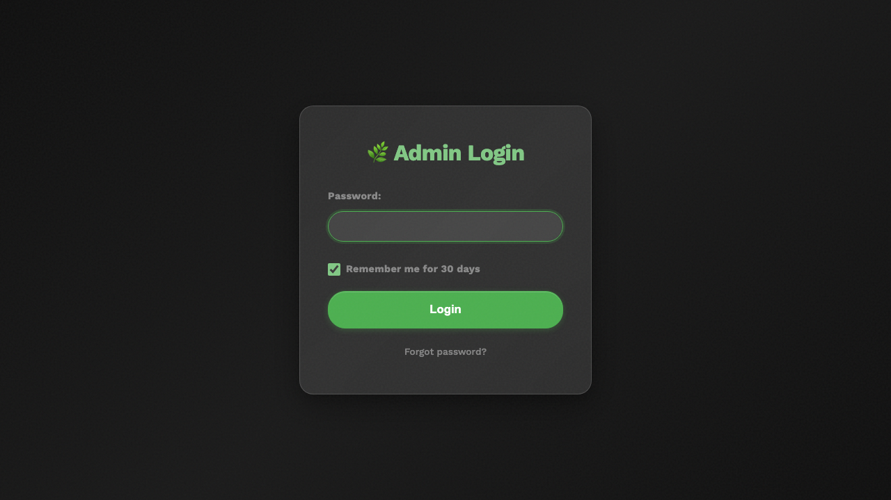
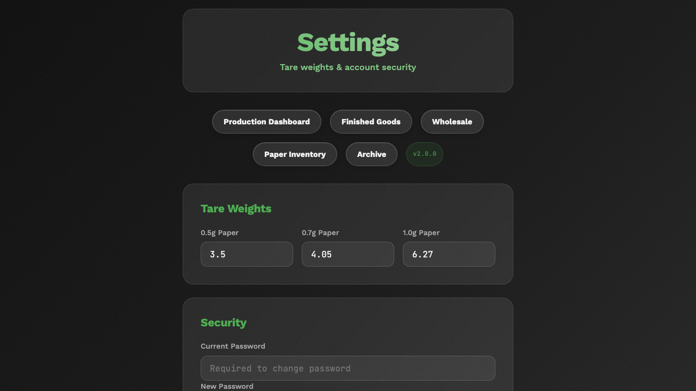
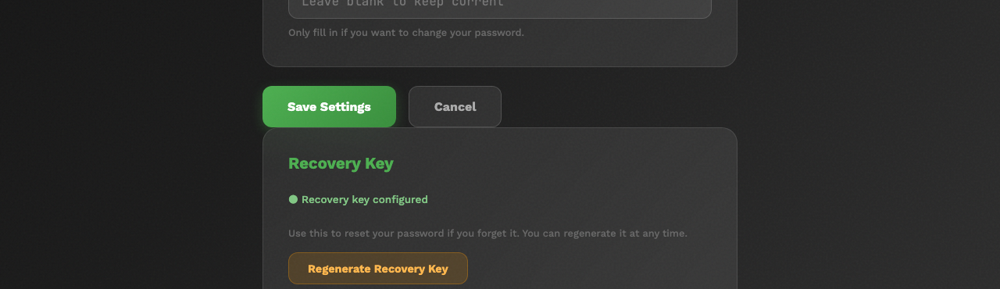
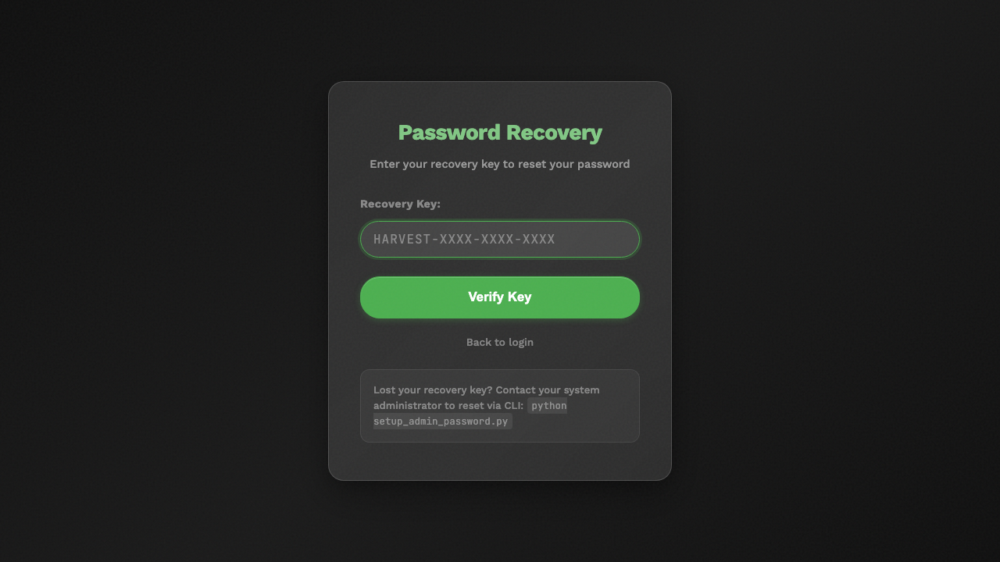

# System Administration Guide

## Overview

This guide covers the day-to-day administration of PreRollTracker (the web-based production dashboard at himomstats.online) and ApexAPI (the desktop application for order management and inventory sync). It is written for system administrators who are comfortable with computers but do not need to write code.

Both applications share a single-admin-password authentication model. PreRollTracker runs as a web server, while ApexAPI runs as a standalone Windows desktop application. This guide walks through user management, API key management, recovery key setup, monitoring, and rate limiting.

---

## 1. User Management

### 1.1 Understanding the Authentication Model

PreRollTracker uses a **single admin password** model. There is one password that grants full access to the admin dashboard. There are no individual user accounts or role-based access levels.

- The password is stored as a **bcrypt hash** in the server's `.env` file (environment variable `ADMIN_PASSWORD_HASH`).
- When someone logs in, the password they type is hashed and compared against the stored hash. The actual password is never stored in plain text.
- Sessions last 30 days by default when "Remember Me" is checked, or until the browser is closed if it is not.
- Session cookies are HTTP-only and marked Secure in production to prevent theft.

| Authentication Feature | Details |
|---|---|
| Password storage | bcrypt hash in `.env` file |
| Session duration | 30 days (with "Remember Me") |
| Session cookie flags | HttpOnly, Secure (production), SameSite=Lax |
| CSRF protection | Enabled via Flask-WTF, tokens live as long as the session |
| Max upload size | 16 MB |



### 1.2 Changing the Admin Password

There are two ways to change the admin password: from the command line, or from the web-based settings page.

#### Method 1: Command-Line Script (Recommended for Initial Setup)

Use the standalone password setup script. This does not require the Flask application to be running.

1. SSH into the server where PreRollTracker is installed.
2. Navigate to the application directory:
   ```
   cd /opt/preroll-tracker
   ```
3. Activate the virtual environment:
   ```
   source venv/bin/activate
   ```
4. Run the password setup script:
   ```
   python3 setup_password_standalone.py
   ```
5. The script will prompt you to either enter a custom password or press Enter to auto-generate a secure one.
6. If you type a custom password, you will be asked to confirm it.
7. The script outputs the bcrypt hash and offers to write it directly to the `.env` file.
8. If the `.env` file already contains `ADMIN_PASSWORD_HASH`, the script asks for confirmation before overwriting.
9. Restart the application for the change to take effect:
   ```
   sudo systemctl restart preroll-tracker
   ```

**Important:** If you choose to auto-generate a password, write it down immediately. The generated password is shown only once and cannot be recovered later.

#### Method 2: Settings Page (From the Web Interface)

1. Log in to the PreRollTracker admin dashboard.
2. Navigate to **Settings**.
3. Find the **Change Password** section.
4. Enter a new password and confirm it.
5. Click **Save**. The new password takes effect immediately for future logins (your current session remains active).



### 1.3 What Happens if You Forget the Password

If you forget the admin password and have a recovery key configured, you can reset it through the web interface at `/forgot-password`. See Section 3 below for recovery key details.

If you do not have a recovery key, you must use the command-line method described in Method 1 above, which requires SSH access to the server.

---

## 2. Managing API Keys

### 2.1 What the API Key Is For

PreRollTracker generates a unique API key that external programs (like ApexAPI) use to interact with the dashboard programmatically. The API key is sent in the `X-API-Key` HTTP header with every API request.

This is different from the admin password:
- The **admin password** is for human users logging in through a web browser.
- The **API key** is for software programs that talk to PreRollTracker's API endpoints.

| Feature | Admin Password | API Key |
|---|---|---|
| Used by | Humans via browser | Software programs |
| Sent via | Login form (POST body) | `X-API-Key` HTTP header |
| Storage | bcrypt hash in `.env` | Plain text in database settings |
| Regeneration | Manual password change | One-click regeneration |

### 2.2 Viewing the Current API Key

1. Log in to the PreRollTracker admin dashboard.
2. Navigate to **Settings**.
3. The API key is displayed in the **API Configuration** section.
4. You can also retrieve it programmatically:
   ```
   curl -H "X-API-Key: YOUR_CURRENT_KEY" https://himomstats.online/api/api-key
   ```

The API key is auto-generated the first time it is requested. It is a 32-character URL-safe token.



### 2.3 Regenerating the API Key

If you suspect the API key has been compromised, regenerate it immediately:

1. Log in to the PreRollTracker admin dashboard.
2. Navigate to **Settings**.
3. Click **Regenerate API Key**.
4. The old key is invalidated immediately. Any program using the old key will stop working.
5. Copy the new key and update it in all programs that use it (particularly ApexAPI's `apex_config.json` file, in the `dashboard_api_key` field).

**Warning:** Regenerating the API key breaks all existing integrations until they are updated with the new key. Plan to update ApexAPI's configuration immediately after regeneration.

### 2.4 How API Key Authentication Works

When a request includes the `X-API-Key` header, PreRollTracker compares the provided key against the stored key using a constant-time comparison (to prevent timing attacks). If the key matches, the request is allowed. If not, a 401 Unauthorized response is returned.

API key authentication bypasses CSRF protection, since it is designed for programmatic access. Browser-based sessions still require CSRF tokens.

---

## 3. Recovery Key Setup and Usage

### 3.1 What Is a Recovery Key?

A recovery key is a backup credential you can use to reset the admin password if you forget it. It follows the format:

```
HARVEST-XXXX-XXXX-XXXX
```

Where `XXXX` represents groups of random uppercase letters and digits. The recovery key is hashed with bcrypt and stored in the database, just like the admin password. The plain-text key is shown only once when generated.

### 3.2 Setting Up a Recovery Key

Recovery keys are generated in two scenarios:

1. **During password reset:** After you successfully reset the admin password using a recovery key, a new recovery key is automatically generated and displayed.
2. **Through the settings page:** You can generate a recovery key from the admin dashboard settings.

**Steps to set up a recovery key from settings:**

1. Log in to the PreRollTracker admin dashboard.
2. Navigate to **Settings**.
3. Find the **Recovery Key** section.
4. Click **Generate Recovery Key**.
5. A key in the format `HARVEST-XXXX-XXXX-XXXX` is displayed.
6. **Write this key down on paper or store it in a secure password manager.** It will not be shown again.

### 3.3 Using a Recovery Key

1. Go to the PreRollTracker login page.
2. Click **Forgot Password**.
3. If no recovery key is configured, you will see a message indicating that. Use the command-line method instead.
4. Enter your recovery key in the field and submit.
5. If valid, you are given a time-limited (10-minute) session to set a new password.
6. Enter and confirm a new password.
7. A **new recovery key** is generated and displayed. Save it immediately since the old one is now invalid.



---

## 4. Setting Up ApexAPI Tokens

### 4.1 Apex Trading API Token

ApexAPI connects to the Apex Trading platform to pull order data. It authenticates with a Bearer token.

1. Log in to your Apex Trading account at `https://app.apextrading.com`.
2. Navigate to your account settings or API access section.
3. Generate a personal access token.
4. Open the `apex_config.json` file in the ApexAPI installation directory.
5. Set the `api_token` field to your token:
   ```
   "api_token": "130|xEkXWyHGBWUb46HQA8UsQKrTUwCaJq33tmPRXwUH"
   ```
6. Save the file and restart ApexAPI.
7. The application will validate the token on startup by calling the `/api/v1/welcome` endpoint.

### 4.2 Dashboard API Key (PreRollTracker Connection)

ApexAPI also connects to PreRollTracker's API for inventory sync and batch data.

1. Log in to PreRollTracker and copy the API key from the Settings page (see Section 2.2).
2. Open `apex_config.json` in the ApexAPI directory.
3. Set the `dashboard_api_key` field:
   ```
   "dashboard_api_key": "45cf0a80-7502-4cbb-884d-83875fbc2190"
   ```
4. Save the file and restart ApexAPI.
5. ApexAPI connects to `https://himomstats.online` by default and sends the key via the `X-API-Key` header.

[SCREENSHOT: ApexAPI settings showing the Dashboard API Key field with a Test Connection button]

### 4.3 Verifying Token Connectivity

After configuring both tokens, verify connectivity:

1. Open ApexAPI.
2. Check the status indicators in the application. They should show green for both Apex Trading and Dashboard connections.
3. If a connection fails, check the `logs/` directory in the ApexAPI folder for detailed error messages.

---

## 5. Monitoring System Health

### 5.1 Backup Status

PreRollTracker has a built-in backup health check endpoint:

```
GET https://himomstats.online/api/backup-status
```

This returns a JSON payload with:

| Field | Description |
|---|---|
| `last_backup_time` | Timestamp of the most recent backup |
| `last_backup_size_bytes` | Size of the most recent backup file |
| `local_backup_count` | Number of local backup files on disk |
| `remote_backup_count` | Number of backup releases on GitHub |
| `last_remote_tag` | Git tag of the most recent remote backup |
| `last_status` | `success`, `failed`, or `never_run` |
| `last_error` | Error message if the last backup failed |

Backups run automatically every **6 hours**. If `last_status` shows `failed`, check the application logs and verify that environment variables (`BACKUP_ENCRYPTION_KEY`, `GITHUB_REPO`) are set correctly.

### 5.2 Sentry Error Tracking

PreRollTracker integrates with Sentry for real-time error monitoring. Sentry captures unhandled exceptions and sends alerts.

- **Dashboard:** Log in to your Sentry project to view error reports.
- **Configuration:** The Sentry DSN is set via the `SENTRY_DSN` environment variable in the `.env` file.
- **Traces:** Sampling rates are set to 5% for both transaction traces and profiles to minimize performance impact.
- **Filtering:** Connection resets, broken pipes, and timeout errors are automatically filtered out to reduce noise.

If Sentry shows a spike in errors, check the application logs at `/opt/preroll-tracker/logs/preroll_tracker.log` for additional context.

### 5.3 Application Logs

PreRollTracker writes logs to two locations:

1. **Application log file:** `logs/preroll_tracker.log` (rotating, 10 MB max, 10 backup files).
2. **systemd journal:** View with `sudo journalctl -u preroll-tracker -f`.

ApexAPI writes logs to the `logs/` directory in its installation folder. Log level is configurable in `apex_config.json` via the `log_level` field (default: `INFO`).

### 5.4 Service Health Checks

To check if PreRollTracker is running:

```
sudo systemctl status preroll-tracker
```

To view live logs:

```
sudo journalctl -u preroll-tracker -f
```

To check the nginx reverse proxy:

```
sudo systemctl status nginx
sudo nginx -t
```

---

## 6. Rate Limiting Configuration

### 6.1 How Rate Limiting Works

PreRollTracker uses Flask-Limiter to protect against brute-force attacks and API abuse. Rate limits are applied per IP address using the `get_remote_address` function.

The application is configured with **no global default limits**, but specific routes have their own limits:

| Route | Limit | Purpose |
|---|---|---|
| `/login` (POST) | Implicit via session | Prevent brute-force password guessing |
| `/forgot-password` (POST) | 2 per minute | Prevent recovery key brute-force |
| `/reset-password` (POST) | 5 per minute | Prevent password reset abuse |
| API endpoints | No explicit limit | Protected by API key requirement |

### 6.2 Adjusting Rate Limits

Rate limits are defined in the application code (not in configuration files). To change them, a developer would need to modify the Flask route decorators. As an administrator, you should be aware of these limits but typically do not need to change them.

If legitimate users are hitting rate limits (for example, if they are locked out after too many failed login attempts), you can:

1. Wait for the limit window to reset (usually 1 minute).
2. Restart the application, which clears in-memory rate limit counters:
   ```
   sudo systemctl restart preroll-tracker
   ```

### 6.3 IP Address Detection Behind Nginx

Since PreRollTracker runs behind an nginx reverse proxy, the real client IP is forwarded via the `X-Real-IP` and `X-Forwarded-For` headers. The nginx configuration sets these headers automatically:

```
proxy_set_header X-Real-IP $remote_addr;
proxy_set_header X-Forwarded-For $proxy_add_x_forwarded_for;
```

Flask-Limiter uses `get_remote_address` to extract the correct IP. If you change the proxy setup, ensure these headers are still being forwarded correctly, or all rate limits will apply to the proxy's IP instead of individual clients.

---

## 7. Common Administrative Tasks

### 7.1 Restarting Services

**PreRollTracker:**
```
sudo systemctl restart preroll-tracker
```

**Nginx:**
```
sudo systemctl restart nginx
```

### 7.2 Checking Active Batches

Use the management script on the server:
```
cd /opt/preroll-tracker
source venv/bin/activate
python3 manage.py status
python3 manage.py list-batches
```

### 7.3 Creating a Manual Backup

```
cd /opt/preroll-tracker
source venv/bin/activate
python3 manage.py backup
```

### 7.4 Viewing Audit Logs

Audit logs track every change to batch data (field changes, status transitions, inventory updates). They are stored in the `audit_log` table of the SQLite database. You can view them through the admin dashboard or query the database directly:

```
sqlite3 preroll_tracker.db "SELECT ts, batch, strain, field, old, new FROM audit_log ORDER BY ts DESC LIMIT 20;"
```

---

## 8. Security Best Practices

1. **Use strong passwords.** The auto-generated passwords from `setup_password_standalone.py` are 16+ character URL-safe tokens. Use them when possible.
2. **Store the recovery key securely.** Write it on paper and store it in a locked location, or use a password manager.
3. **Regenerate the API key periodically.** Even if it has not been compromised, rotating keys is good practice.
4. **Keep the `.env` file restricted.** Only the application user should be able to read it:
   ```
   chmod 600 /opt/preroll-tracker/.env
   ```
5. **Monitor Sentry alerts.** Investigate any unusual error patterns immediately.
6. **Keep software updated.** Regularly update Python dependencies and the operating system.
7. **Use HTTPS in production.** The application enforces secure cookies when `FLASK_ENV=production`, which requires HTTPS to function correctly.

---

## 9. Finished Goods Administration

Finished Goods represent completed pre-roll packages that have been assigned a METRC tag and are ready for wholesale distribution. This section covers every administrative operation you can perform on finished goods packages, from creation through archival.

### 9.1 Creating New Finished Goods Packages

A finished goods package should be created after a production batch reaches the **Done** stage and a METRC package tag has been generated in the state tracking system.

**Steps to create a new package:**

1. Navigate to the **Finished Goods** page from the main navigation.
2. Click the **+ Add Package** button at the top of the page.
3. Fill in the required fields:

| Field | Required | Description |
|---|---|---|
| METRC Number | Yes | The state-issued package tag (e.g., `1A406030003B866000012345`) |
| Strain Name | Yes | The strain associated with this package |
| Initial Grams | Yes | The starting weight in grams as reported by METRC |
| Notes | No | Free-text field for any additional context |
| Source Batch ID | No | Links this package back to the production batch that produced it |

4. Click **Save**. The package appears on the Finished Goods page with an **Active** status.

> **What You'll See:** The new package appears as a card on the Finished Goods page showing the METRC number, strain, current grams, and any configured Apex inventory data. Active packages are displayed by default.


### 9.2 Correcting Inventory (Adding and Deducting Grams)

Inventory corrections are made directly from a package card on the Finished Goods page. Every addition or deduction is recorded in the audit trail for compliance purposes.

#### Adding Grams

Use the **+ Add** button on a package card to increase the gram count. Common reasons include:

- New material transferred into an existing package
- METRC adjustment after a manifest correction
- Data entry correction from initial package creation

**Steps:**

1. Locate the package on the Finished Goods page.
2. Click the **+ Add** button on the package card.
3. Choose the input method:
   - **By grams:** Enter the number of grams to add directly.
   - **By units:** Select a unit size (0.5g, 1.0g, 6pack, 12pack) and enter the number of units. The system calculates the gram equivalent automatically.
4. Enter an optional reason (recommended for audit purposes).
5. Click **Confirm**. The package's gram count updates immediately.

#### Deducting Grams

Use the **- Deduct** button on a package card to decrease the gram count. Common reasons include:

- Damaged product removed from inventory
- Product loss (breakage, spillage)
- Manual sale or sample not processed through the normal order system

**Steps:**

1. Locate the package on the Finished Goods page.
2. Click the **- Deduct** button on the package card.
3. Choose the input method:
   - **By grams:** Enter the number of grams to deduct directly.
   - **By units:** Select a unit size (0.5g, 1.0g, 6pack, 12pack) and enter the number of units.
4. Enter an optional reason (recommended for audit purposes).
5. Click **Confirm**. The package's gram count updates immediately.

> **What You'll See:** After either operation, the package card reflects the updated gram count. The change is logged in the package history, accessible from the package detail view.


### 9.3 Physical Inventory Overrides

When a physical shelf count does not match the value tracked in the METRC system, you can set a **Physical Override** to tell PreRollTracker the actual grams on hand. This override becomes the "effective grams" used for all inventory calculations, including Apex inventory counts and wholesale hold availability.

**Steps to set a Physical Override:**

1. Locate the package on the Finished Goods page.
2. Click the **⋮** (three-dot menu) on the package card.
3. Select **Physical Override**.
4. Enter the actual physical gram count from your shelf count.
5. Click **Save**.

> **What You'll See:** The package card displays an **orange border** to indicate that a Physical Override is active. The effective grams shown on the card reflect the override value rather than the calculated system value.

**Steps to clear a Physical Override:**

1. Click the **⋮** menu on the package card.
2. Select **Physical Override**.
3. Clear the field (set it to null or empty).
4. Click **Save**. The orange border disappears and the system reverts to the calculated gram value.

| Override State | Card Appearance | Grams Used for Calculations |
|---|---|---|
| No override | Normal card (no border) | System-calculated grams |
| Override active | Orange border on card | Physical override value |

### 9.4 Archiving and Restoring Packages

Packages that are no longer active (fully sold, transferred, or depleted) can be archived to keep the Finished Goods page clean. Archived packages are hidden from the default view but can be restored at any time.

#### Archiving a Package

1. Locate the package on the Finished Goods page.
2. Click the **⋮** menu on the package card.
3. Select **Archive**.
4. Confirm the action.

**Prerequisite:** All wholesale holds on the package must be released before it can be archived. If holds exist, the system will display an error. Release or complete all outstanding holds first (see Section 9.6).

#### Restoring an Archived Package

1. On the Finished Goods page, enable **Show Archived / Orphaned** using the toggle or filter control.
2. Locate the archived package in the list.
3. Click the **⋮** menu on the package card.
4. Select **Restore**.
5. The package returns to the active list.

#### Marking a Package as Orphaned

An **orphan** designation means the package has weight on paper (in METRC) but no corresponding physical product on the shelf. This is a bookkeeping distinction that helps during reconciliation.

1. Click the **⋮** menu on the package card.
2. Select **Mark as Orphan**.

#### Permanently Deleting a Package

1. Click the **⋮** menu on the package card.
2. Select **Delete**.
3. Confirm the action.

**Warning:** Permanent deletion is irreversible. The package record and all associated wholesale holds are removed from the database via CASCADE. Only use this for packages created in error, not for depleted packages (use Archive instead).


### 9.5 Configuring Apex Auto-Inventory

Apex Auto-Inventory calculates unit counts from gram totals and syncs them to the Apex Trading platform so that retail stores see accurate availability. Each package can be individually configured.

#### Enabling Apex for a Package

1. Locate the package on the Finished Goods page.
2. Click the **Apex ON** button on the package card.
3. The system enables auto-calculation using default SKU settings.

#### Configuring Per-SKU Settings

After enabling Apex, click the **Apex ON** button again (or navigate to the Apex settings for that package) to access detailed configuration:

| Setting | Description |
|---|---|
| **Exclude SKU** | When enabled, this SKU will not appear in the Apex inventory for this package |
| **manual_units** | Override the calculated unit count with a fixed number |
| **auto_calculate** | When `true`, units are recalculated from grams automatically; when `false`, the `manual_units` value is used |
| **Custom SKUs** | Add non-standard sizes (e.g., 0.8g, CannaDart, Cocoa Blunt) with their own grams-per-unit conversion |

**Steps to configure a SKU:**

1. Click the **Apex ON** button on the package card to open Apex settings.
2. For each SKU row, adjust the settings as needed:
   - Toggle **Exclude** to hide the SKU from Apex Trading.
   - Set **auto_calculate** to `false` and enter a **manual_units** value to override the automatic count.
   - Click **+ Add Custom SKU** to create a non-standard size. Enter the SKU name and grams-per-unit value.
3. Click **Save**.

> **What You'll See:** The **APEX INVENTORY** section on the package card displays the calculated or manual unit counts for each active SKU. These are the values that stores see when browsing your inventory on Apex Trading.


### 9.6 Managing Wholesale Holds (Admin View)

Wholesale holds reserve a portion of a package's inventory for a pending order. As an administrator, you can view and manage holds across all packages.

#### Viewing All Holds

Navigate to the **Wholesale** page to see a consolidated list of all active holds across every finished goods package. Each hold shows the package METRC number, customer name, grams held, and order status.

#### Understanding the Order Lifecycle

| Stage | Description |
|---|---|
| **Hold** | Grams are reserved for the order. The package's available grams decrease, but no inventory is deducted yet. |
| **Pack** | The order is being prepared for shipment. The hold remains in place. |
| **Complete** | The order is fulfilled. Grams are permanently deducted from the package inventory. |

#### Force-Releasing a Hold

If an order is cancelled or a hold was created in error:

1. Locate the hold on the Wholesale page (or on the specific package's detail view).
2. Click the **⋮** menu on the hold row.
3. Select **Release Hold**.
4. Confirm the action. The reserved grams return to the package's available inventory.

#### Completing an Order

1. Click the **⋮** menu on the hold row.
2. Select **Complete Order**.
3. Enter the grams to fulfill (this may differ from the original hold amount).
4. Click **Confirm**. The specified grams are permanently deducted from the package inventory and the hold is closed.

### 9.7 Exporting Finished Goods Data

#### API Access

Finished goods data is available programmatically through the PreRollTracker API:

```
GET https://himomstats.online/api/finished-goods/
```

This returns all packages as JSON. Authenticate with the `X-API-Key` header (see Section 2 for API key details).

#### Audit History

All changes to finished goods packages are recorded in the `finished_goods_history` table. This includes gram additions, deductions, overrides, archive/restore actions, and Apex configuration changes.

#### SQLite Query Examples

**List all active packages with current grams:**
```
sqlite3 preroll_tracker.db "SELECT metrc_number, strain, current_grams FROM finished_goods WHERE status = 'active' ORDER BY strain;"
```

**View recent history for a specific package:**
```
sqlite3 preroll_tracker.db "SELECT timestamp, action, old_value, new_value, reason FROM finished_goods_history WHERE metrc_number = '1A406030003B866000012345' ORDER BY timestamp DESC LIMIT 20;"
```

**Sum total grams across all active packages:**
```
sqlite3 preroll_tracker.db "SELECT SUM(current_grams) as total_grams FROM finished_goods WHERE status = 'active';"
```


### 9.8 Weekly Reconciliation Workflow

Perform this reconciliation weekly to ensure your system inventory matches both physical counts and METRC records.

1. **Pull the finished goods summary.** Open the Finished Goods page and note the summary cards at the top (total active packages, total grams, total held grams).
2. **Compare system grams to METRC.** Log in to METRC and pull a manifest or inventory report. Compare each package's gram count in PreRollTracker against the METRC value.
3. **Conduct a physical shelf count.** Walk the vault or storage area and count the actual product on hand for each METRC tag.
4. **Apply Physical Overrides for discrepancies.** For any package where the physical count does not match the system value, set a Physical Override (see Section 9.3). This ensures downstream calculations (Apex inventory, wholesale availability) reflect reality.
5. **Document reasons.** Enter a note in the package's notes field explaining the discrepancy (e.g., "Physical count 42g vs system 45g — 3g breakage found during count 2026-02-28").
6. **Review package history.** Check the history for each adjusted package to identify any unexpected changes since the last reconciliation. Look for additions or deductions that lack a documented reason.

> **What You'll See:** After reconciliation, any packages with Physical Overrides active will display an orange border on their cards, giving you a quick visual indicator of where system and physical counts diverge.

| Reconciliation Step | Where | What to Check |
|---|---|---|
| System summary | Finished Goods page (summary cards) | Total packages, total grams, total held |
| METRC comparison | METRC portal | Per-package gram counts match |
| Physical count | Vault / storage area | Actual product on shelf |
| Override entry | Package card ⋮ menu → Physical Override | Set actual grams |
| Documentation | Package notes field | Reason for discrepancy |
| History review | Package detail → History tab | Unexpected or undocumented changes |

---

## Summary

| Task | How |
|---|---|
| Change admin password (CLI) | `python3 setup_password_standalone.py` then restart |
| Change admin password (web) | Settings > Change Password |
| View API key | Settings > API Configuration |
| Regenerate API key | Settings > Regenerate API Key |
| Set up recovery key | Settings > Generate Recovery Key |
| Reset forgotten password | `/forgot-password` with recovery key |
| Check backup health | `GET /api/backup-status` |
| View error reports | Sentry dashboard |
| Restart application | `sudo systemctl restart preroll-tracker` |
| Check service status | `sudo systemctl status preroll-tracker` |
| Create a finished goods package | Finished Goods > + Add Package |
| Add grams to a package | Package card > + Add (by grams or units) |
| Deduct grams from a package | Package card > - Deduct (by grams or units) |
| Set a physical override | Package card ⋮ menu > Physical Override |
| Archive a package | Package card ⋮ menu > Archive (release holds first) |
| Restore an archived package | Show Archived / Orphaned > ⋮ menu > Restore |
| Delete a package permanently | Package card ⋮ menu > Delete |
| Enable Apex auto-inventory | Package card > Apex ON |
| Configure Apex SKU settings | Apex ON button > per-SKU settings |
| Release a wholesale hold | Wholesale page > ⋮ menu > Release Hold |
| Complete a wholesale order | Wholesale page > ⋮ menu > Complete Order |
| Export finished goods data | `GET /api/finished-goods/` |
| Weekly reconciliation | See Section 9.8 workflow |
