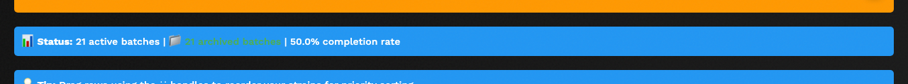
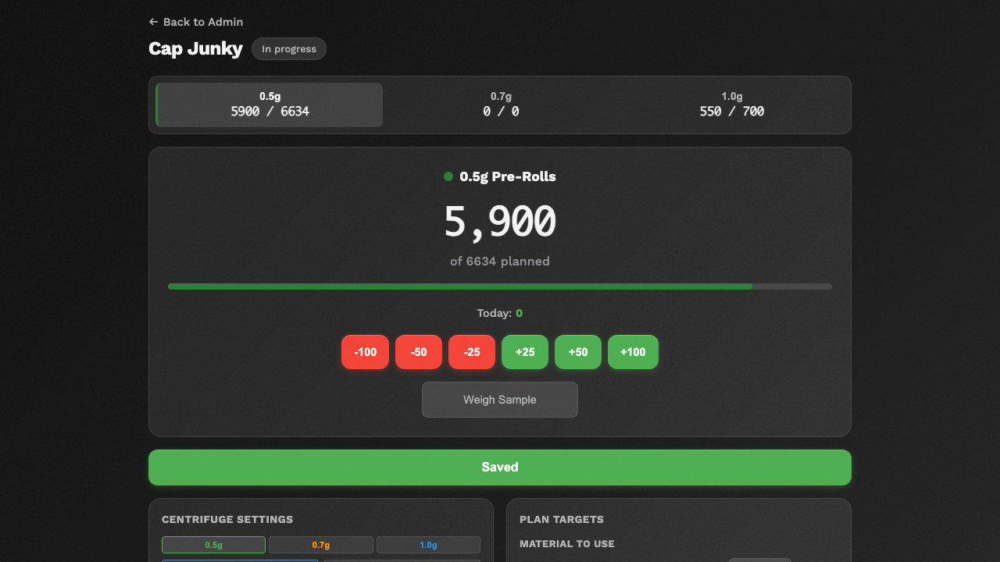
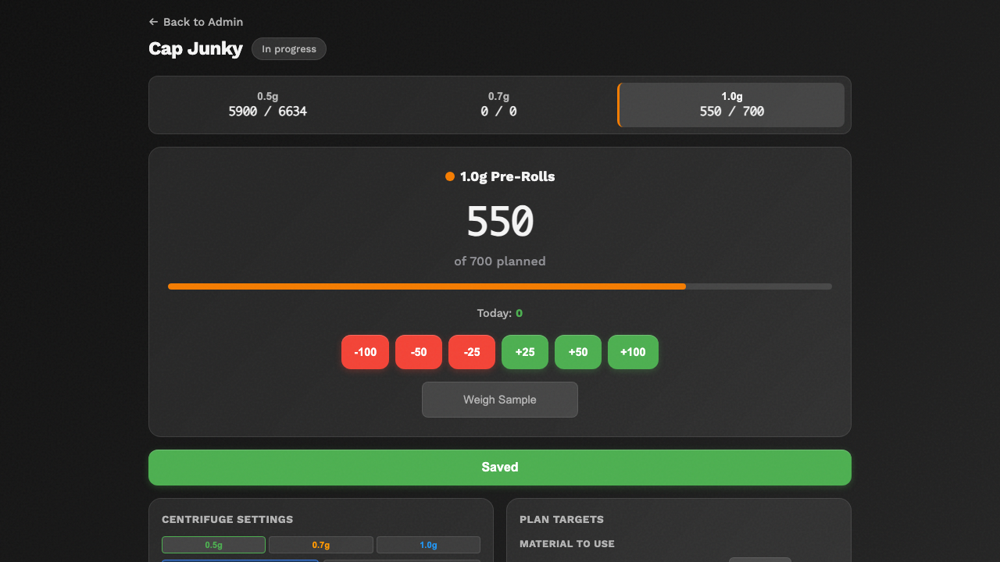
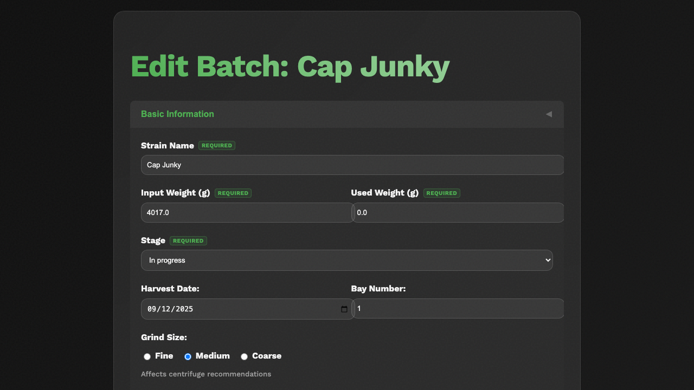
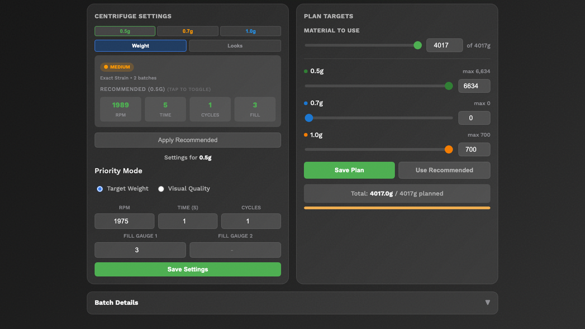
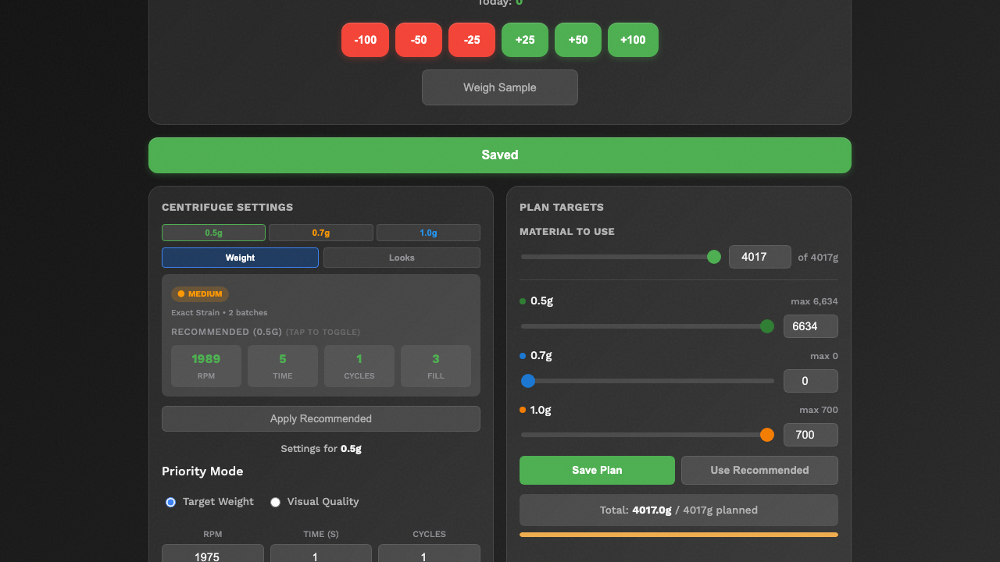
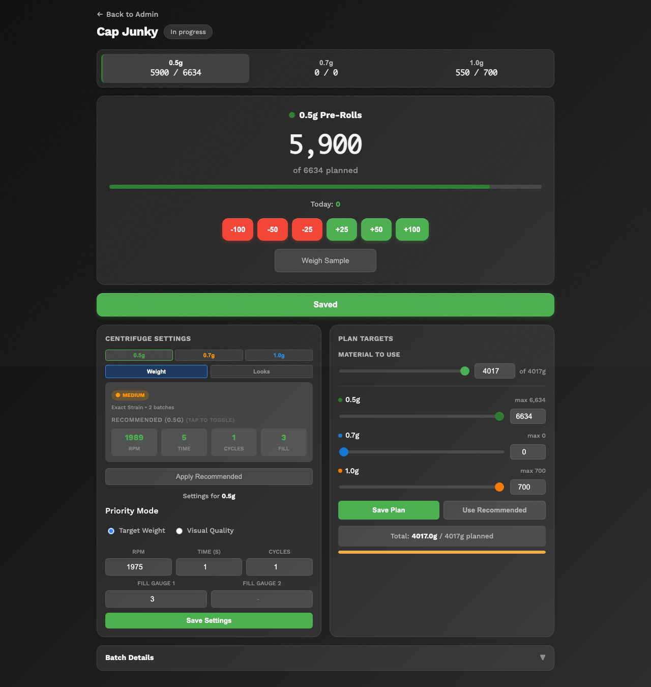

# Daily Operations Guide

This guide covers everything you do day-to-day when working with PreRollTracker. Follow these steps to record your production, update batch progress, and keep everything on track.

---

## Starting Your Day: Checking the Dashboard

Every work day should start by checking the Production Dashboard to see what needs attention.

1. Open PreRollTracker by going to **himomstats.online** in your browser (or tapping the app icon on your home screen if you installed it).
2. If you are not already logged in, type the password and click **Login**.
3. You are now on the **Production Dashboard**. Take a moment to look at what is on screen.

**What to Look For:**

- **Active batches** -- Look at the list of batches. Check which ones are in the "In progress" stage (blue badge) -- these are the ones being worked on today.
- **Orange alert banners** -- If you see an orange banner at the top, it means paper or cone inventory is running low for one or more sizes. Tell your supervisor right away.
- **Red alert banners** -- If you see a red banner, it means a batch has been waiting on testing for a long time. Your supervisor may need to follow up with the lab.
- **Stage colors** -- Quickly scan the colored stage badges to understand the overall status of all batches.

### If Something Goes Wrong
- **The page shows old data** -- Pull down to refresh on a phone, or press the **F5** key on a computer keyboard. This reloads the latest data.
- **You see no batches at all** -- Either all batches have been archived, or there may be a connection issue. Try refreshing the page. If still empty, ask your supervisor.

---

## Understanding Batch Stages and What They Mean

Every batch of pre-rolls moves through stages in order. Knowing what each stage means helps you understand what needs to happen next.

| Stage | Name | What It Means | What Happens Next |
|---|---|---|---|
| 0 | **Not ground** | Flower has arrived but has not been put through the grinder yet | Grind the flower |
| 1 | **Ground** | Flower has been ground and is ready to load into the machine | Begin rolling pre-rolls |
| 2 | **In progress** | Pre-rolls are being actively rolled and counted | Keep rolling until the batch is complete |
| 3 | **Finished** | All rolling is done for this batch | Send a sample for lab testing |
| 4 | **Waiting on testing** | A test sample has been sent to the lab | Wait for results to come back |
| 5 | **Test passed** | Lab results are in and the batch passed | Begin packaging |
| 6 | **Bagging** | Pre-rolls are being put into final packaging (tubes, bags, packs) | Finish packaging |
| 7 | **Done** | Everything is complete -- batch is ready for sale or wholesale | Batch will be archived |

The system moves through these stages in order. Some transitions happen automatically (for example, when you finish grinding all the grams, the stage may advance from "Not ground" to "Ground" on its own). Other transitions need to be done by hand.

---

## Recording Production Counts (0.5g, 0.7g, 1.0g)

This is the most important thing you do in the app. When you make pre-rolls, you need to record how many you made in each size.

### Updating Counts from the Plan Page

1. On the **Production Dashboard**, find the batch you are working on.
2. Click the **Plan** button next to that batch. This opens the **Plan page** for that batch.
3. At the top of the Plan page, you will see **size tabs** showing each size and its count:
   - **0.5g** -- for half-gram pre-rolls
   - **0.7g** -- for 0.7-gram pre-rolls
   - **1.0g** -- for one-gram pre-rolls
4. **Click the size tab** for the size you are currently rolling. The page switches to show that size's count and progress bar.
5. Use the **+25**, **+50**, or **+100** buttons (green) to add to your count, or the **-25**, **-50**, **-100** buttons (red) to subtract if you made a mistake. The large number in the center updates immediately.
6. The count saves automatically. You will see the **Saved** button turn green to confirm.

**What You'll See:** A large count display for the active size with a progress bar showing how close you are to the planned target. The size tabs at the top always show your current count vs. planned count for all three sizes.

### Switching Between Sizes

To work on a different size, simply **click the size tab** at the top of the Plan page. The page instantly switches to show that size's count, progress, and centrifuge settings. You do not need to go back to the dashboard.

### Important Notes About Counting
- Always enter the **total** count, not just the number made since your last entry. If you had 200 and made 50 more, type **250**.
- You can update counts as often as you like -- every 50 pre-rolls, every 100, or whenever you take a break.
- The system keeps a history of your count changes for accurate rate tracking.
- If you make a mistake, just type the correct number and it will be updated.

### If Something Goes Wrong
- **The count didn't save** -- Check your internet connection. If the **Saved** button does not turn green, try refreshing the page and using the +/- buttons again.
- **The total looks wrong** -- Make sure you are on the correct size tab. Check the size tabs at the top to verify you are updating the right size.

---

## Updating Batch Status (Moving Through Stages)

When a batch reaches the next step in the process, you need to update its stage.

1. From the **Production Dashboard**, click or tap the batch you want to update to open the **Edit Batch** page.
2. Find the **Stage** dropdown or section on the edit page. It shows the current stage of the batch.
3. Select the next stage from the dropdown. The stages go in order:
   - Not ground -> Ground -> In progress -> Finished -> Waiting on testing -> Test passed -> Bagging -> Done
4. Click **Save** or the update button to save the change.

**What You'll See:** The stage badge on the dashboard will change to the new color and name.

### Automatic Stage Changes
Some stage changes happen automatically:
- When you update the **Grams Ground** field to match the full input grams amount, the batch automatically moves from "Not ground" to "Ground."
- Your supervisor may move batches through testing and packaging stages.

### Moving a Batch Back to a Previous Stage
Sometimes you need to go back to an earlier stage (for example, if you need to do more grinding or rolling). You can select an earlier stage from the dropdown. The system tracks this in the audit history.

### If Something Goes Wrong
- **The stage did not change** -- Make sure you clicked the Save or Update button after selecting the new stage. Just selecting it from the dropdown is not enough.
- **You accidentally set the wrong stage** -- Simply change it again to the correct stage. The system records all changes in the audit log.

---

## Tracking Work Hours and Production Sessions

The system tracks how long you work on each batch. This is used to calculate your production rate (pre-rolls per hour).

### How Session Tracking Works

When a batch moves to the **"In progress"** stage (stage 2), the system starts a timer automatically. This is called a "production session."

- **Starting a session** -- The session begins when the batch is moved to "In progress."
- **Pausing a session** -- If you move the batch back to "Ground" (for example, to do more grinding), the current session ends and the time is saved.
- **Resuming a session** -- When you move the batch back to "In progress," a new session starts. The system keeps track of all sessions separately.
- **Ending a session** -- When the batch moves to "Finished" (stage 3), the final session ends.

The system adds up the time from all sessions to calculate your **total work hours** for that batch.

### Viewing Your Total Work Time

1. Open the **Plan page** for any batch (click **Plan** on the dashboard).
2. Scroll down to the **Batch Details** section at the bottom. It shows:
   - Total work hours across all sessions
   - When the batch started production
   - When the batch was finished (if applicable)

### If Something Goes Wrong
- **The timer seems wrong** -- The timer runs based on when the stage was changed. If someone forgot to change the stage back to "Ground" during a break, the timer may include break time. Ask your supervisor to adjust if needed.
- **The production rate shows nothing** -- You need to have at least some pre-rolls recorded and some time elapsed for the rate to calculate.

---

## Adding Centrifuge Settings to a Batch

If your production process uses a centrifuge, you can record the settings used for each batch. This helps the system learn and recommend better settings over time.

1. Open the **Plan page** for the batch (click **Plan** on the dashboard).
2. Scroll down to the **Centrifuge Settings** section on the left side. The settings shown are for the **currently selected size** — use the size tabs in the centrifuge section (0.5g, 0.7g, 1.0g) to switch between sizes.
3. For the size you are running, fill in the following:
   - **RPM** -- The speed setting on the centrifuge (for example, 1200).
   - **Time (seconds)** -- How long each cycle runs (for example, 45).
   - **Cycles** -- How many cycles you ran (usually 1 or 2).
   - **Fill Gauge Cycle 1** -- The fill gauge reading for the first cycle (a number from 1 to 12).
   - **Fill Gauge Cycle 2** -- The fill gauge reading for the second cycle (only if you ran 2 cycles).
   - **Priority Mode** -- Choose between **Target Weight** or **Visual Quality** depending on your focus.
4. Click **Save Settings** to store the centrifuge settings.

**What You'll See:** The centrifuge settings are saved for that size. The section also shows which **machine** you are using (Silver Bullet or Lab Geek).

### Centrifuge Recommendations

After enough batches of the same strain have been processed, the system can recommend centrifuge settings based on past results. Look for the green **Recommendation** card at the top of the Centrifuge Settings section — it shows recommended RPM, time, cycles, and fill gauge based on previous batches of the same strain. Click **Apply Recommended** to use the suggested settings.

### If Something Goes Wrong
- **There are no recommendations** -- The system needs data from at least a few completed batches of the same strain before it can make recommendations. Keep recording settings and they will appear over time.
- **The fill gauge field won't accept my number** -- The fill gauge must be between 1 and 12. Make sure you are entering a whole number.

---

## Recording Weight Measurements

To maintain quality, you may need to record weight checks during production. The system tracks weight measurements for each pre-roll size.

1. Open the **Plan page** for the batch (click **Plan** on the dashboard).
2. Click the **Weigh Sample** button in the counting area. This opens the weight entry dialog for the currently selected size.
3. Enter the weight measurement when prompted.
4. Click **Save** or **Log Weight** to record the measurement.

**What You'll See:** The weight is added to the running weight log for that size. The system calculates a **running yield percentage** that tells you how accurate your pre-rolls are compared to the target weight.

### Understanding Yield Percentage
- **High yield (green)** -- Your pre-rolls are close to the target weight. Good job.
- **Medium yield (orange)** -- Your pre-rolls are slightly off. You may need to adjust your technique or machine settings.
- **Low yield (red)** -- Your pre-rolls are significantly off from the target weight. Check your settings and talk to your supervisor.

### If Something Goes Wrong
- **The yield shows 0%** -- Make sure you have entered both production counts and weight measurements. The yield cannot be calculated without both.
- **I entered the wrong weight** -- Contact your supervisor. Weight entries are recorded in the audit log for accuracy.

---

## Viewing Your Production Rate

The system calculates how many pre-rolls you make per hour. This helps track productivity and plan future batches.

1. Open the **Plan page** for any batch that is "In progress" or later.
2. The Plan page shows a **Today's Production** widget that tracks your output for the current session. Additionally, the **Batch Details** section at the bottom shows:
   - **Total work hours** across all sessions
   - **Production rate** -- pre-rolls per hour
   - **Progress** toward planned targets for each size

### How the Rate is Calculated

The system divides the total number of pre-rolls by the total work hours (excluding breaks and pauses). For example:
- You made 500 pre-rolls in 4 hours of work = 125 pre-rolls per hour.

The rate updates automatically as you record more counts and as time passes.

### Tips for Tracking Your Rate
- Update your counts regularly (every 30-60 minutes) for the most accurate rate tracking.
- The rate is only calculated when the batch is in the "In progress" stage or later.
- Pausing (moving the batch back to "Ground") will stop the timer, so your breaks do not affect the rate.

### If Something Goes Wrong
- **No rate is showing** -- The batch needs to be at least in the "In progress" stage with some pre-rolls recorded and some time elapsed.
- **The rate seems too high or too low** -- Make sure your counts are correct and that the production session times are accurate. Talk to your supervisor if something seems off.

---

## End-of-Day Checklist

Before you leave for the day, do these things:

1. **Update your counts** -- Make sure the pre-roll counts in the system match what you actually produced.
2. **Check the stage** -- If you finished a batch, move it to the next stage. If you are stopping mid-batch and will continue tomorrow, leave it at "In progress." The session timer will continue, but you can note the pause for your supervisor.
3. **Check inventory alerts** -- If you saw any low-stock alerts during the day, make sure your supervisor knows.
4. **Do not log out** -- If you have "Remember me" turned on, you can just close the browser or the app. You will still be logged in tomorrow.

---

## Summary

You now know how to:

- Check the dashboard at the start of your day
- Understand what each batch stage means
- Record production counts for 0.5g, 0.7g, and 1.0g pre-rolls
- Move batches through their stages
- Track work hours and production sessions
- Record centrifuge settings
- Log weight measurements
- View your production rate

For information about viewing reports and statistics, see the **Reporting Guide**.
