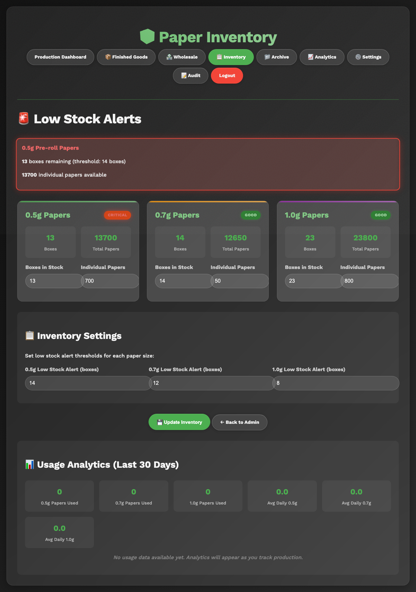
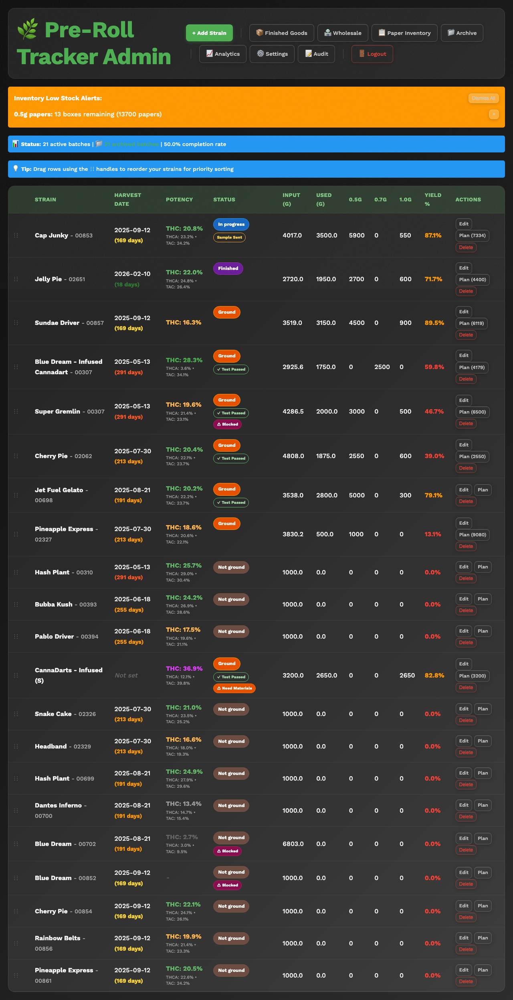
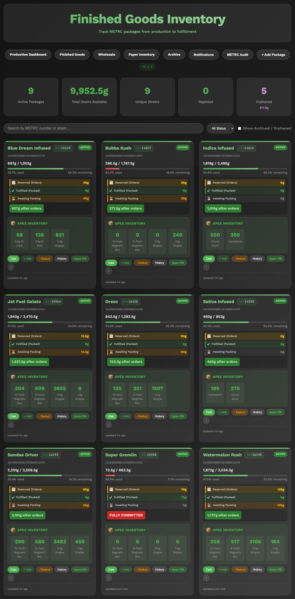
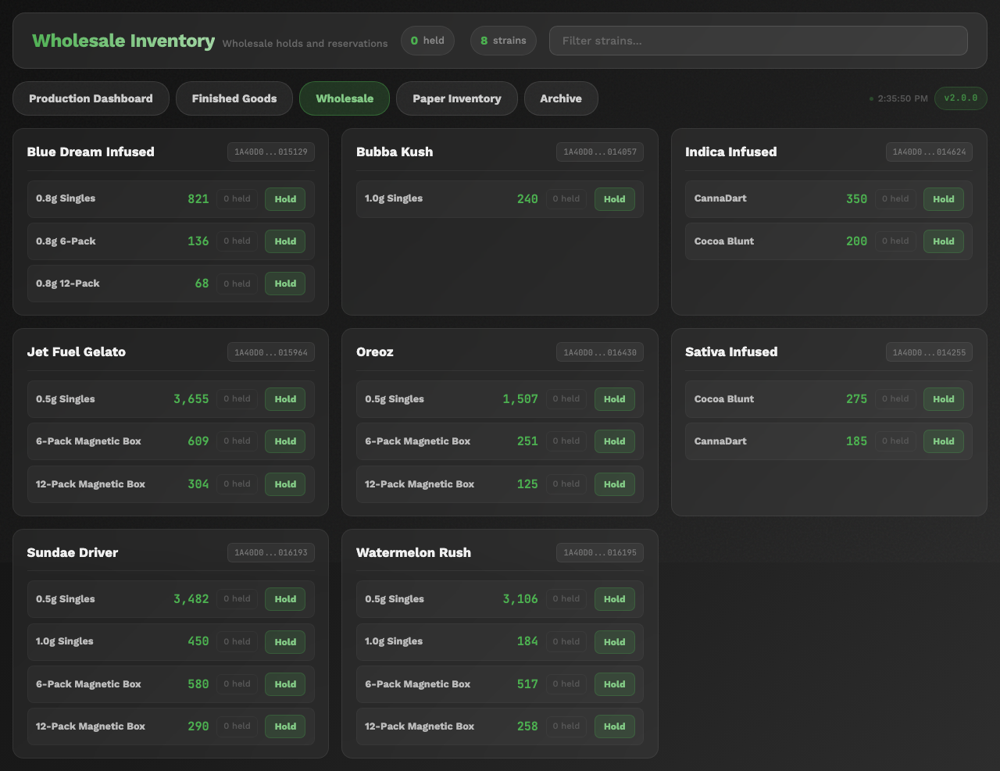

# Managing Inventory Guide

This guide covers how to check and update inventory in PreRollTracker. Inventory includes paper/cone supplies (for rolling), finished goods (completed METRC packages), and wholesale holds (orders reserved for wholesale customers).

---

## Checking Paper and Cone Inventory Levels

Paper and cone inventory tracks how many rolling papers or cones you have for each pre-roll size. This is important so you do not run out of supplies in the middle of a batch.

### Getting to the Paper Inventory Page

1. From the **Production Dashboard**, click the **Paper Inventory** button in the navigation bar. On a phone, tap the **menu button** (three horizontal lines) and then tap **Paper Inventory**.

**What You'll See:** A page titled "Paper Inventory" showing inventory levels for each pre-roll size.

### Understanding the Inventory Display

For each pre-roll size (0.5g, 0.7g, and 1.0g), you will see:

- **Boxes** -- How many full, unopened boxes of papers/cones you have in stock.
- **Individual Papers** -- Any loose papers beyond full boxes (for example, if you opened a box and used some).
- **Total Papers** -- The combined total. This is calculated automatically: (Boxes x Papers Per Box) + Individual Papers.
- **Days Remaining** -- An estimate of how many days the current supply will last, based on how fast you have been using them.
- **Low Stock Warning** -- If the supply is below the alert threshold, you will see a warning indicator.

### Papers Per Box by Size

The system knows how many papers come in each box:

| Size | Papers Per Box |
|---|---|
| 0.5g | 1,000 papers per box |
| 0.7g | 900 papers per box |
| 1.0g | 1,000 papers per box |

### If Something Goes Wrong
- **The numbers look outdated** -- Refresh the page to see the latest data. Someone else may have updated the inventory since you last checked.
- **"Days Remaining" shows a strange number** -- This estimate is based on recent usage patterns. If production has been unusual lately (very fast or very slow), the estimate may be off.

---

## Updating Inventory Counts (Boxes and Individual Papers)

When new supplies arrive or when you do a physical count, you need to update the inventory numbers in the system.

### Updating Inventory from the Paper Inventory Page

1. Go to the **Paper Inventory** page.
2. Find the size you want to update (0.5g, 0.7g, or 1.0g).
3. Look for the input fields for **Boxes** and **Individual Papers**.
4. Change the **Boxes** number to the current number of full, unopened boxes you have on the shelf. Count them physically -- do not guess.
5. Change the **Individual Papers** number to the count of any loose papers that are not part of a full box. If all papers are in full boxes, leave this at 0.
6. Click the **Update** or **Save** button.

**What You'll See:** The total papers count updates automatically. The "days remaining" estimate recalculates too.

### Example

You receive a shipment of 0.5g papers and now have:
- 12 full boxes (12 x 1,000 = 12,000 papers)
- 347 loose papers from a previously opened box

You would enter:
- **Boxes:** 12
- **Individual Papers:** 347
- **Total Papers** (calculated automatically): 12,347

### Updating from the Admin Page

Your supervisor can also update inventory from the admin inventory page, which provides additional settings and threshold controls.

1. Navigate to **Paper Inventory** through the admin navigation.
2. Enter the new counts.
3. Optionally update the **low stock threshold** (the number of papers at which a warning appears).
4. Click **Save**.

### If Something Goes Wrong
- **I typed the wrong number** -- Simply type the correct number and click Save again. The system always uses the latest number you enter.
- **The inventory keeps going down even though I updated it** -- This is normal. As pre-rolls are produced and counts are updated, the system tracks paper usage and decreases inventory automatically. Your update just resets the starting count.

---

## Understanding Low Stock Alerts and What to Do

When paper or cone inventory drops below the alert threshold, the system warns you. These alerts appear in two places:

### Where You See Alerts

1. **On the Production Dashboard** -- An orange banner appears at the top of the page listing which sizes are running low.
2. **On the Paper Inventory page** -- Low stock items are highlighted with a warning indicator.

### What to Do When You See a Low Stock Alert

1. **Tell your supervisor immediately.** They need to know so supplies can be ordered before you run out.
2. **Check the actual count.** Look at the Paper Inventory page to see exactly how many papers are left and how many days they are expected to last.
3. **Do not ignore the alert.** Running out of papers means production has to stop, which is costly.

### Dismissing Alerts

After you have reported the low stock to your supervisor:

1. On the **Production Dashboard**, you can dismiss individual alerts by clicking the **X** or **Dismiss** button next to each alert.
2. You can also click **Dismiss All** to clear all inventory alerts at once.
3. Dismissing an alert just hides the message. If inventory is still low, the alert will come back the next time the system checks.

### If Something Goes Wrong
- **Alerts keep coming back after I dismiss them** -- This means inventory is still below the threshold. The alert will not go away permanently until inventory is restocked above the threshold level.
- **I don't see any alerts even though we are low** -- The alert thresholds may need to be adjusted. Ask your supervisor to check the threshold settings on the Paper Inventory page.

---

## Working with Finished Goods (METRC Packages)

Finished Goods are batches that have been completed, packaged, and assigned a METRC tracking number. METRC is the tracking system used by the state to track cannabis from production to sale.

### Getting to the Finished Goods Page

1. From the **Production Dashboard**, click the **Finished Goods** button in the navigation bar. On a phone, tap the **menu button** and then tap **Finished Goods**.

**What You'll See:** A page titled "Finished Goods" showing all completed packages with their METRC numbers, strain names, quantities, and status.

### Understanding the Finished Goods Display

Each finished goods package shows:

- **METRC Number** -- The official tracking number assigned by the METRC system. This is a long number or code.
- **Strain** -- The name of the strain.
- **SKU Breakdown** -- How many pre-rolls of each size and package type are in this METRC package.
- **Status** -- Whether the package is active (has units available), depleted (all units sold or reserved), or archived.
- **Wholesale Holds** -- If any units from this package have been reserved for wholesale orders, they show up here.

### Searching Finished Goods

The Finished Goods page has a search bar:
1. Tap or click the **Search** bar at the top of the page.
2. Type a METRC number or strain name.
3. The list filters to show only matching packages.

### Viewing Package Details

Click or tap any package to see its full details, including:
- Complete METRC tracking information
- SKU breakdown by size (0.5g, 0.7g, 1.0g)
- Package types (singles, 6-packs, 12-packs)
- Current available units
- Wholesale holds applied to this package

### If Something Goes Wrong
- **A package is missing** -- Check if you have the "Include Archived" filter turned on. Depleted packages may be hidden by default.
- **The counts don't match what I expect** -- Wholesale holds reduce the available quantity. Check the wholesale holds section to see if units have been reserved.

---

## Understanding SKU Breakdowns

SKU stands for "Stock Keeping Unit" -- it is the specific product type that is sold. In PreRollTracker, SKUs break down by:

- **Pre-roll size** -- 0.5g, 0.7g, or 1.0g
- **Package type** -- Singles (individual tubes), 6-packs, or 12-packs

### How to Read a SKU Breakdown

On the Finished Goods page, each METRC package shows its SKU breakdown. For example:

| SKU | Quantity |
|---|---|
| 0.5g Singles | 200 units |
| 0.5g 6-Packs | 30 packs (180 pre-rolls) |
| 1.0g Singles | 150 units |
| 1.0g 12-Packs | 10 packs (120 pre-rolls) |

The breakdown shows you exactly how the pre-rolls from each batch were packaged and are available for sale.

### Packaging Breakdown on Batches

During the **Bagging** stage, your supervisor tracks how pre-rolls are being packaged. The batch detail shows:
- **Singles** -- Individual pre-rolls in tubes
- **6-Packs** -- Packs of 6 pre-rolls
- **12-Packs** -- Packs of 12 pre-rolls
- **Loose/Tupperware** -- Pre-rolls set aside for flexible packaging later

This packaging data flows into the finished goods SKU breakdown once the batch is completed and a METRC package is created.

### If Something Goes Wrong
- **The SKU numbers don't add up to the total** -- This can happen if some pre-rolls are still loose (in tupperware) and have not been assigned to a specific package type yet.

---

## Using the Wholesale Holds Feature

Wholesale holds allow you to reserve units from finished goods packages for specific wholesale customers or orders before they are shipped.

### Getting to the Wholesale Page

1. From the **Production Dashboard**, click the **Wholesale** button in the navigation bar. On a phone, tap the **menu button** and then tap **Wholesale**.

**What You'll See:** A page showing all available strains with their current inventory and any existing holds.

### Creating a Wholesale Hold

1. On the **Wholesale** page, find the strain and package you want to reserve units from.
2. Click the **Hold** or **Reserve** button for that product.
3. In the form that appears:
   - Select the **METRC number** (the specific package to hold from).
   - Select the **SKU** (which size and package type to hold).
   - Enter the **Quantity** -- how many units to reserve.
   - Add **Notes** if needed (for example, the customer name or order number).
4. Click **Create Hold** or **Reserve**.

**What You'll See:** The hold appears in the list with a hold ID. The available quantity for that SKU decreases by the amount held.

### Viewing and Managing Holds

All active holds are visible on the Wholesale page:
- Each hold shows the METRC number, SKU, quantity, and any notes.
- The **available** quantity shown for each SKU already accounts for all active holds.

### Releasing a Hold

When a wholesale order is shipped or cancelled, you need to release the hold:

1. Find the hold on the **Wholesale** page.
2. Click the **Release** or **Delete** button next to the hold.
3. Confirm that you want to release the hold.

**What You'll See:** The hold is removed and the available quantity goes back up.

### If Something Goes Wrong
- **"Only X units available"** -- You are trying to hold more units than are currently available. Check if other holds already exist for the same SKU.
- **I released the wrong hold** -- Contact your supervisor. They may be able to recreate the hold.
- **The quantities look wrong** -- Make sure you are looking at the correct METRC package and SKU. Different packages of the same strain may have different available quantities.

---

## Summary

You now know how to:

- Check paper and cone inventory levels
- Update inventory counts when supplies arrive
- Understand and respond to low stock alerts
- View and search finished goods METRC packages
- Read SKU breakdowns
- Create and release wholesale holds

For help with common problems, see the **Troubleshooting Guide**.
