# Managing Inventory Guide

This guide covers how to check and update inventory in PreRollTracker. Inventory includes paper/cone supplies (for rolling), finished goods (completed METRC packages), and wholesale holds (orders reserved for wholesale customers).

---

## Checking Paper and Cone Inventory Levels

Paper and cone inventory tracks how many rolling papers or cones you have for each pre-roll size. This is important so you do not run out of supplies in the middle of a batch.

### Getting to the Paper Inventory Page

1. From the **Production Dashboard**, click the **Paper Inventory** button in the navigation bar. On a phone, tap the **menu button** (three horizontal lines) and then tap **Paper Inventory**.

**What You'll See:** A page titled "Paper Inventory" showing inventory levels for each pre-roll size.


### Understanding the Inventory Display

For each pre-roll size (0.5g, 0.7g, and 1.0g), you will see:

- **Boxes** -- How many full, unopened boxes of papers/cones you have in stock.
- **Individual Papers** -- Any loose papers beyond full boxes (for example, if you opened a box and used some).
- **Total Papers** -- The combined total. This is calculated automatically: (Boxes x Papers Per Box) + Individual Papers.
- **Days Remaining** -- An estimate of how many days the current supply will last, based on how fast you have been using them.
- **Low Stock Warning** -- If the supply is below the alert threshold, you will see a warning indicator.

### Papers Per Box by Size

The system knows how many papers come in each box:

| Size | Papers Per Box |
|---|---|
| 0.5g | 1,000 papers per box |
| 0.7g | 900 papers per box |
| 1.0g | 1,000 papers per box |

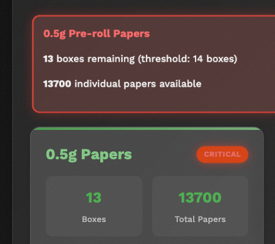

### If Something Goes Wrong
- **The numbers look outdated** -- Refresh the page to see the latest data. Someone else may have updated the inventory since you last checked.
- **"Days Remaining" shows a strange number** -- This estimate is based on recent usage patterns. If production has been unusual lately (very fast or very slow), the estimate may be off.

---

## Updating Inventory Counts (Boxes and Individual Papers)

When new supplies arrive or when you do a physical count, you need to update the inventory numbers in the system.

### Updating Inventory from the Paper Inventory Page

1. Go to the **Paper Inventory** page.
2. Find the size you want to update (0.5g, 0.7g, or 1.0g).
3. Look for the input fields for **Boxes** and **Individual Papers**.
4. Change the **Boxes** number to the current number of full, unopened boxes you have on the shelf. Count them physically -- do not guess.
5. Change the **Individual Papers** number to the count of any loose papers that are not part of a full box. If all papers are in full boxes, leave this at 0.
6. Click the **Update** or **Save** button.

**What You'll See:** The total papers count updates automatically. The "days remaining" estimate recalculates too.

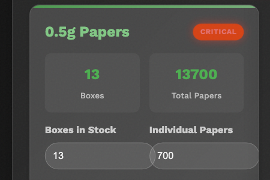

### Example

You receive a shipment of 0.5g papers and now have:
- 12 full boxes (12 x 1,000 = 12,000 papers)
- 347 loose papers from a previously opened box

You would enter:
- **Boxes:** 12
- **Individual Papers:** 347
- **Total Papers** (calculated automatically): 12,347

### Updating from the Admin Page

Your supervisor can also update inventory from the admin inventory page, which provides additional settings and threshold controls.

1. Navigate to **Paper Inventory** through the admin navigation.
2. Enter the new counts.
3. Optionally update the **low stock threshold** (the number of papers at which a warning appears).
4. Click **Save**.


### If Something Goes Wrong
- **I typed the wrong number** -- Simply type the correct number and click Save again. The system always uses the latest number you enter.
- **The inventory keeps going down even though I updated it** -- This is normal. As pre-rolls are produced and counts are updated, the system tracks paper usage and decreases inventory automatically. Your update just resets the starting count.

---

## Understanding Low Stock Alerts and What to Do

When paper or cone inventory drops below the alert threshold, the system warns you. These alerts appear in two places:

### Where You See Alerts

1. **On the Production Dashboard** -- An orange banner appears at the top of the page listing which sizes are running low.
2. **On the Paper Inventory page** -- Low stock items are highlighted with a warning indicator.

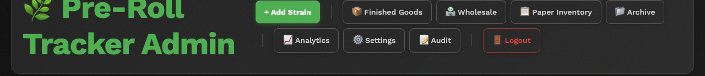

### What to Do When You See a Low Stock Alert

1. **Tell your supervisor immediately.** They need to know so supplies can be ordered before you run out.
2. **Check the actual count.** Look at the Paper Inventory page to see exactly how many papers are left and how many days they are expected to last.
3. **Do not ignore the alert.** Running out of papers means production has to stop, which is costly.

### Dismissing Alerts

After you have reported the low stock to your supervisor:

1. On the **Production Dashboard**, you can dismiss individual alerts by clicking the **X** or **Dismiss** button next to each alert.
2. You can also click **Dismiss All** to clear all inventory alerts at once.
3. Dismissing an alert just hides the message. If inventory is still low, the alert will come back the next time the system checks.


### If Something Goes Wrong
- **Alerts keep coming back after I dismiss them** -- This means inventory is still below the threshold. The alert will not go away permanently until inventory is restocked above the threshold level.
- **I don't see any alerts even though we are low** -- The alert thresholds may need to be adjusted. Ask your supervisor to check the threshold settings on the Paper Inventory page.

---

## Working with Finished Goods (METRC Packages)

Finished Goods are batches that have been completed, packaged, and assigned a METRC tracking number. METRC is the state-mandated tracking system for cannabis products from production to sale. The Finished Goods page is one of the most important pages in PreRollTracker -- it shows everything available for stores to order, tracks how much product remains, and connects directly to the Apex Trading ordering system.

### Getting to the Finished Goods Page

1. From the **Production Dashboard**, click the **Finished Goods** button in the navigation bar. On a phone, tap the **menu button** (three horizontal lines) and then tap **Finished Goods**.

**What You'll See:** A page titled "Finished Goods Inventory" with summary cards at the top, a search/filter bar, and package cards below.

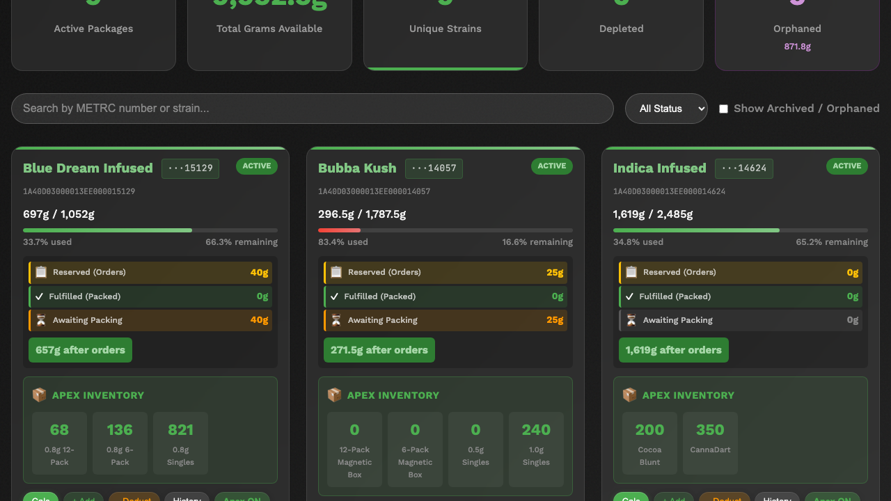

---

### Understanding the Finished Goods Dashboard

At the top of the Finished Goods page, you will see **summary cards** showing key numbers at a glance:

| Card | What It Shows |
|------|--------------|
| **Active Packages** | How many METRC packages currently have product available |
| **Total Grams Available** | The combined weight of all available product across all packages |
| **Unique Strains** | How many different strains are in stock |
| **Depleted** | Packages where all product has been ordered, packed, or fulfilled |
| **Orphaned** | Packages marked as having weight on paper but no physical product |

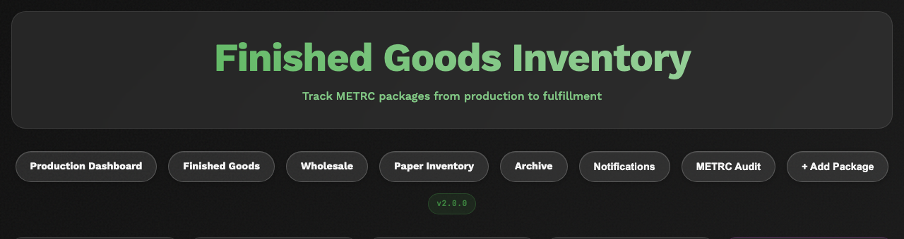

These summary numbers update in real time as orders are placed, product is packed, and packages are archived.

---

### Reading a Package Card

Each package on the Finished Goods page is displayed as a card. Here is what each part of the card means:

**Header Area:**
- **Strain Name** -- Shown in green at the top left (for example, "Blue Dream Infused").
- **Short METRC Number** -- The last 5 digits of the full METRC package number, shown next to the strain name. Click it to see the full number.
- **Status Badge** -- A colored badge in the top right showing the package status.

**Package Status Reference:**

| Status | Color | Meaning |
|--------|-------|---------|
| **Active** | Green | Package has available product to order |
| **Depleted** | Orange | All product has been ordered, packed, or fulfilled |
| **Archived** | Gray | Package removed from active view (still in system) |
| **Orphaned** | Purple | Weight exists on paper but no physical product |

**Grams Section:**
- **Grams Used / Total Grams** -- Shows how much of the original weight has been consumed. For example, "499g / 1,015g" means 499 grams have been ordered or packed out of 1,015 total.
- **Percentage Used / Remaining** -- Shows consumption as a percentage. For example, "49.0% used, 51.0% remaining."
- **Progress Bar** -- A visual bar that fills from left to right as grams are consumed. Green means plenty available; it shifts toward red as the package is depleted.

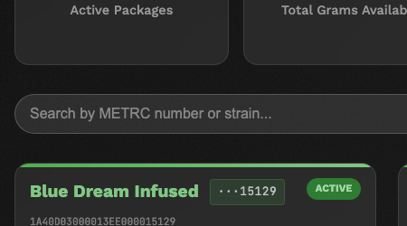

**Order Tracking Section:**
Below the grams bar, you will see order tracking indicators:

| Indicator | Color | What It Means |
|-----------|-------|--------------|
| **Reserved (Orders)** | Yellow | Grams that have been ordered but not yet packed |
| **Fulfilled (Packed)** | Green | Grams that have been packed and shipped |
| **Awaiting Packing** | Orange | Grams ordered but still waiting to be packed |
| **Wholesale Holding** | Purple | Grams reserved by wholesale holds |

- **"XXXg after orders"** -- The green number at the bottom shows how many grams are truly available after accounting for all orders and holds.

---

### How Grams Flow Works

Understanding how grams move through the system is key to reading the Finished Goods page correctly.

Every METRC package starts with a total weight in grams. As orders come in and product is packed and shipped, the grams flow through these stages:

```
Total Grams (original weight)
  └─ Reserved (Orders)     ← Grams reserved for orders, not yet packed
      └─ Packed (Fulfilled) ← Grams physically packed and shipped
  └─ Wholesale Holds       ← Grams reserved for wholesale customers
  └─ Available             ← What's left to order from
```

**Example:** A package starts with 1,000g total:
- 200g have been ordered (reserved)
- 100g of those 200g have been packed and shipped (fulfilled)
- 50g are held for a wholesale customer
- Available grams = 1,000 - 200 - 50 = **750g available to order**

The "Available" number is what stores can order from. It goes down when new orders are placed or wholesale holds are created. It goes up only if orders are cancelled or holds are released.

---

### Searching and Filtering Packages

The Finished Goods page provides several ways to find specific packages:

**Search Bar:**
1. Click the **Search packages** box at the top of the page.
2. Type a METRC number (full or partial) or a strain name.
3. The list filters instantly as you type.

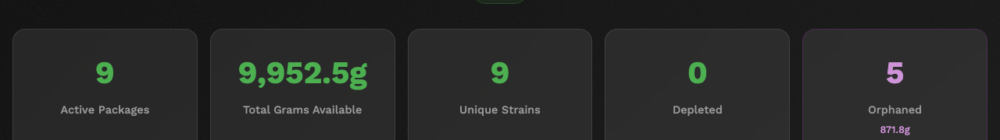

**Status Filter:**
1. Click the **Status** dropdown next to the search bar.
2. Select a status to filter by: **All Status**, **Active**, **Depleted**, **Archived**, or **Orphaned**.

**Show Archived / Orphaned Toggle:**
- By default, archived and orphaned packages are hidden.
- Check the **Show Archived / Orphaned** checkbox to include them in the list.

**Filter by Strain:**
- Use the strain filter (if available) to show only packages for a specific strain.

---

### Viewing Package Details

Each package card shows key information at a glance. For more details:

1. Look at the card for the package you want to inspect.
2. The card shows: strain name, METRC number, grams remaining, order tracking, and the APEX inventory section.

**What You'll See on Each Card:**
- **Full METRC number** -- The complete state-assigned tracking number (for example, 1A40D03000013EE000015129).
- **Grams breakdown** -- How grams are distributed across orders, packed, and available.
- **APEX Inventory** -- Unit counts by SKU type showing exactly how many units are available for Apex Trading.
- **Action buttons** -- Calc, +Add, -Deduct, History, Apex ON, and a menu button (⋮) for more options.

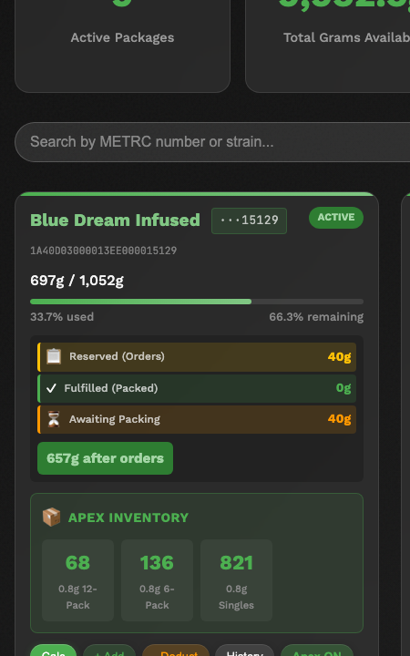

---

### Understanding the APEX Inventory Section

Each package card has an **APEX INVENTORY** section that shows unit counts for the Apex Trading ordering system. This is what stores actually see when they place orders.

The APEX inventory breaks down available product into specific SKU types:

| SKU Type | What It Is | Grams per Unit |
|----------|-----------|----------------|
| **0.5g Singles** | Individual half-gram pre-rolls in tubes | 0.5g each |
| **1.0g Singles** | Individual full-gram pre-rolls in tubes | 1.0g each |
| **0.5g 6-Pack** | Magnetic box containing 6 half-gram pre-rolls | 3.0g total |
| **0.5g 12-Pack** | Magnetic box containing 12 half-gram pre-rolls | 6.0g total |

Some packages may also show **custom SKUs** like:
- **CannaDart** -- A branded single pre-roll
- **Cocoa Blunt** -- A flavored wrap pre-roll
- **0.8g Singles** -- Non-standard size

The unit counts are calculated automatically from the available grams, divided by the grams per unit for each SKU type. Wholesale holds are subtracted before calculating.

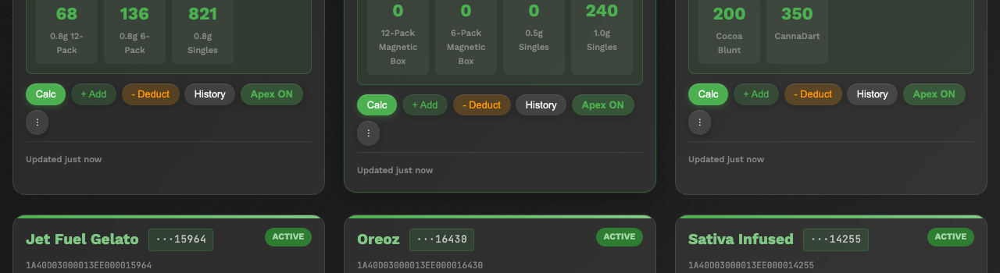

**Reading the Numbers:**
- A number like **821** next to "0.8g Singles" means 821 individual 0.8g pre-rolls can be ordered from this package.
- A number like **136** next to "0.8g 6-Pack" means 136 six-packs can be made from this package.

---

### Using the Package Action Buttons

Each package card has a row of action buttons at the bottom:

| Button | What It Does |
|--------|-------------|
| **Calc** | Opens the pre-roll calculator -- enter grams and see how many units of each SKU type can be made |
| **+ Add** | Add grams to the package (for example, if more product is transferred in) |
| **- Deduct** | Remove grams from the package (for example, for damage or loss) |
| **History** | View a timeline of all changes made to this package |
| **Apex ON/OFF** | Toggle whether this package syncs to Apex Trading automatically |
| **⋮** (More) | Opens a menu with additional options: Complete Order, Archive, Restore, Orphan, Delete, and View History |

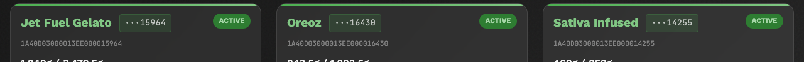

**Using the Calculator:**
1. Click **Calc** on any package card.
2. Enter the number of grams you want to calculate for.
3. The calculator shows how many of each SKU type can be produced from those grams.
4. This is useful for planning orders and checking if a package has enough product for a specific order.

**Viewing Package History:**
1. Click **History** on any package card.
2. A modal opens showing a timeline of every change: grams added, grams deducted, orders placed, Apex unit updates, etc.
3. Each entry shows the time, type of change, and whether it was done manually or via the API.

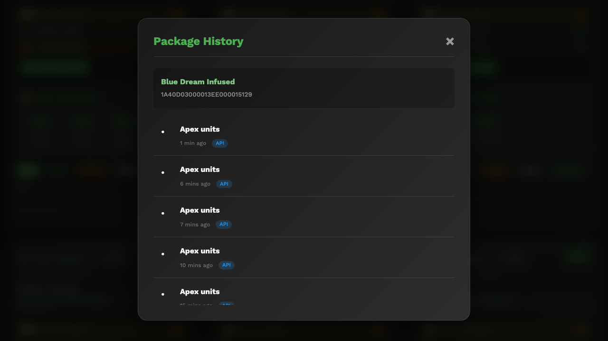

---

### If Something Goes Wrong

- **A package is missing from the list** -- Check if you have the **Show Archived / Orphaned** checkbox turned on. Also check the **Status** filter -- make sure it is set to **All Status**. The package may have been archived by your supervisor.
- **The grams available don't match what I expect** -- Check the order tracking section. Reserved (ordered) grams and wholesale holds both reduce the available amount. The "after orders" number is the true available amount.
- **The APEX inventory numbers are wrong** -- APEX units are calculated from available grams. If grams were recently deducted, added, or ordered, the unit counts update automatically. If they still seem off, tell your supervisor -- they may need to check the Apex SKU settings.
- **A package shows "Depleted" but there is still product on the shelf** -- This means all grams have been allocated to orders or holds. Either the orders need to be completed, or grams need to be added back if the allocation was wrong. Contact your supervisor.
- **I cannot archive a package** -- Active wholesale holds prevent archiving. All holds must be released before a package can be archived.
- **The SKU breakdown shows 0 for everything** -- The Apex SKU settings may not be configured for this package, or all SKUs may be excluded. Contact your supervisor.

---

## Understanding SKU Breakdowns

SKU stands for "Stock Keeping Unit" -- it is the specific product type that is sold. In PreRollTracker, SKUs describe the combination of pre-roll size and packaging format.

### Standard SKU Types

| SKU Name | Size | Pack | Grams per Unit |
|----------|------|------|----------------|
| 0.5g Singles | 0.5g | 1 | 0.5g |
| 1.0g Singles | 1.0g | 1 | 1.0g |
| 0.5g 6-Pack (Magnetic Box) | 0.5g | 6 | 3.0g |
| 0.5g 12-Pack (Magnetic Box) | 0.5g | 12 | 6.0g |

### Custom SKU Types

Some strains have custom SKU types that do not fit the standard sizes. These might include:
- **CannaDart** -- A branded pre-roll product
- **Cocoa Blunt** -- A flavored-wrap pre-roll
- **0.7g Singles** or **0.8g Singles** -- Non-standard weights

Custom SKUs are configured per package by your supervisor. They appear alongside the standard SKUs in the APEX Inventory section.

### How SKU Counts Are Calculated

The system calculates SKU unit counts from the available grams:

1. Start with the **available grams** (total grams minus all orders and holds).
2. For each enabled SKU, divide available grams by grams-per-unit.
3. The result is the number of units available for that SKU.

**Example:** A package has 500g available:
- 0.5g Singles: 500 / 0.5 = **1,000 units**
- 1.0g Singles: 500 / 1.0 = **500 units**
- 0.5g 6-Pack: 500 / 3.0 = **166 packs**
- 0.5g 12-Pack: 500 / 6.0 = **83 packs**

Note: These are all calculated from the same pool of grams, not separate inventories. Selling 100 units of 0.5g Singles uses 50g, which reduces the available units for all other SKUs.

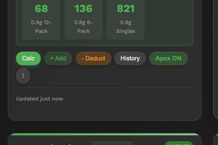

### How SKUs Relate to Apex Trading

The SKU counts on the Finished Goods page are what stores see in the Apex Trading ordering system. When a store places an order through Apex:

1. The order specifies a SKU and quantity.
2. The system calculates the grams required (units x grams per unit).
3. Those grams are reserved from the package.
4. The available units for all SKUs decrease accordingly.

This means keeping SKU counts accurate is critical -- stores rely on these numbers to know what they can order.

### If Something Goes Wrong
- **The SKU numbers don't add up to the total** -- SKU counts are all calculated from the same pool of available grams. They are not separate inventories, so they will overlap.
- **I see custom SKU names I don't recognize** -- Your supervisor configured these. They are specific to certain strains or product types.
- **A SKU shows 0 but there are grams available** -- That SKU may be excluded in the Apex SKU settings. Contact your supervisor.

---

## Using the Wholesale Holds Feature

Wholesale holds allow you to reserve inventory for specific wholesale customers or orders before they are packed and shipped. This ensures that product is set aside and not sold to other stores through Apex.

### Getting to the Wholesale Page

1. From the **Production Dashboard** or the **Finished Goods** page, click the **Wholesale** button in the navigation bar. On a phone, tap the **menu button** and then tap **Wholesale**.

**What You'll See:** A page titled "Wholesale Inventory" showing all strains with their available SKU counts and **Hold** buttons next to each SKU.

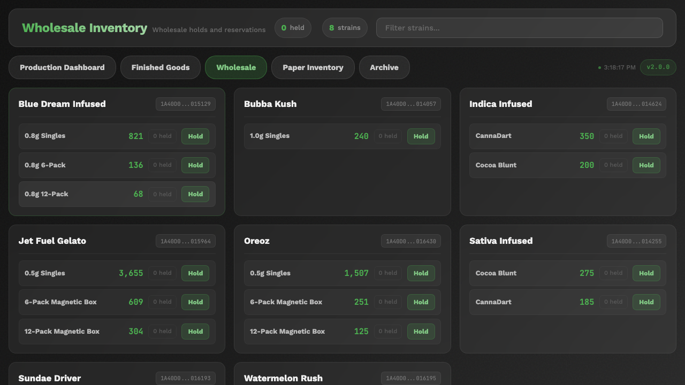

### Understanding the Wholesale Inventory View

The Wholesale page organizes inventory by **strain**, not by METRC package. For each strain, you see:

- **Strain name** with the METRC number(s) underneath
- **Available SKU types** with unit counts (for example, "0.5g Singles: 3,655")
- **Held count** next to each SKU (showing how many are already on hold)
- **Hold** button next to each SKU to create a new hold

The unit counts shown here already subtract any existing holds. What you see is what is truly available for new holds.

### Creating a Wholesale Hold

1. On the **Wholesale** page, find the strain and SKU you want to reserve.
2. Click the **Hold** button next to that SKU.
3. In the form that appears, enter:
   - **Quantity** -- How many units to hold.
   - **Notes** -- Any relevant information (customer name, order number, ship date).
4. Click **Create Hold**.

**What You'll See:** The hold is created. The available count for that SKU decreases by the held amount. The hold appears with a unique hold ID.

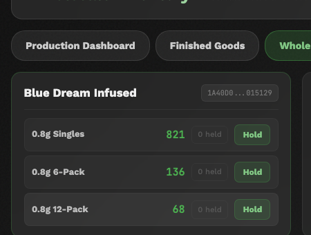

### The Complete Order Lifecycle

Wholesale orders flow through these stages:

| Step | What Happens | Who Does It |
|------|-------------|-------------|
| **1. Hold Created** | Units are reserved from inventory. Available counts decrease. | Wholesale manager |
| **2. Order Confirmed** | Customer confirms the order. | Wholesale manager |
| **3. Items Packed** | Pre-rolls are physically packed for shipping. Grams are deducted from the package. | Production team |
| **4. Order Completed** | Shipment leaves the facility. Hold is released and grams are permanently fulfilled. | Wholesale manager |

At each step, the Finished Goods page updates to reflect the current state of the grams.

### Viewing Active Holds

On the Wholesale page:
- The number of held units appears next to each SKU (for example, "0 held" or "5 held").
- To see details of all holds, check the Finished Goods page -- each package card shows wholesale holds in the order tracking section.

### Releasing a Hold

When a wholesale order is cancelled or no longer needed:

1. Find the hold on the **Wholesale** page or the **Finished Goods** page.
2. Click the **Release** or **Delete** button next to the hold.
3. Confirm that you want to release the hold.

**What You'll See:** The hold is removed and the available quantity goes back up immediately.


### If Something Goes Wrong
- **"Only X units available"** -- You are trying to hold more units than are currently available. Check if other holds already exist for the same SKU. Multiple holds can stack up.
- **I released the wrong hold** -- Contact your supervisor. They can recreate the hold if needed. All hold changes are tracked in the audit history.
- **The wholesale quantities don't match the Finished Goods page** -- The Wholesale page shows quantities grouped by strain across all METRC packages for that strain. The Finished Goods page shows quantities per individual METRC package. The totals should match.
- **I can't find a strain on the Wholesale page** -- Only strains with active (non-archived, non-orphaned) packages appear on the Wholesale page. If a package was archived, the strain may no longer show up.

---

## Summary

You now know how to:

- Check paper and cone inventory levels
- Update inventory counts when supplies arrive
- Understand and respond to low stock alerts
- Navigate and understand the Finished Goods Inventory page
- Read summary cards, package cards, and grams flow
- Understand the APEX inventory section and SKU calculations
- Use the package action buttons (Calc, Add, Deduct, History)
- Search and filter packages by status, strain, and METRC number
- Read SKU breakdowns (standard and custom)
- Navigate and use the Wholesale Inventory page
- Create, view, and release wholesale holds
- Understand the complete order lifecycle

For help with common problems, see the **Troubleshooting Guide**.
