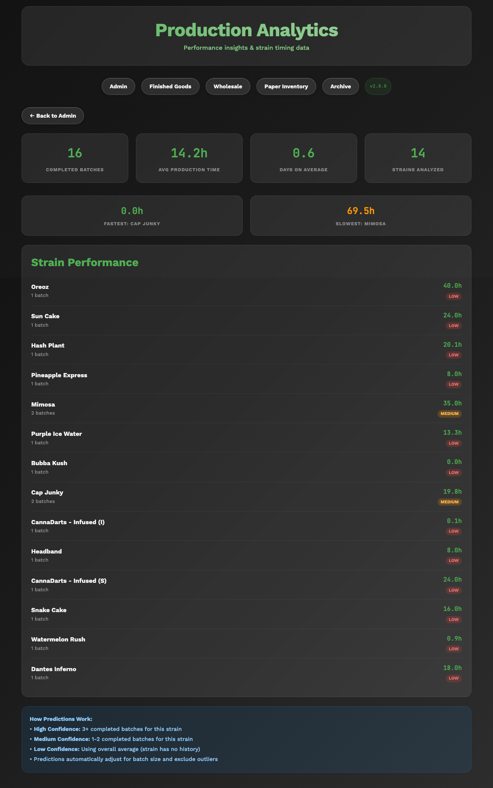
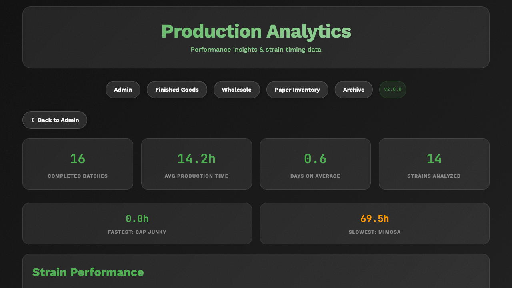
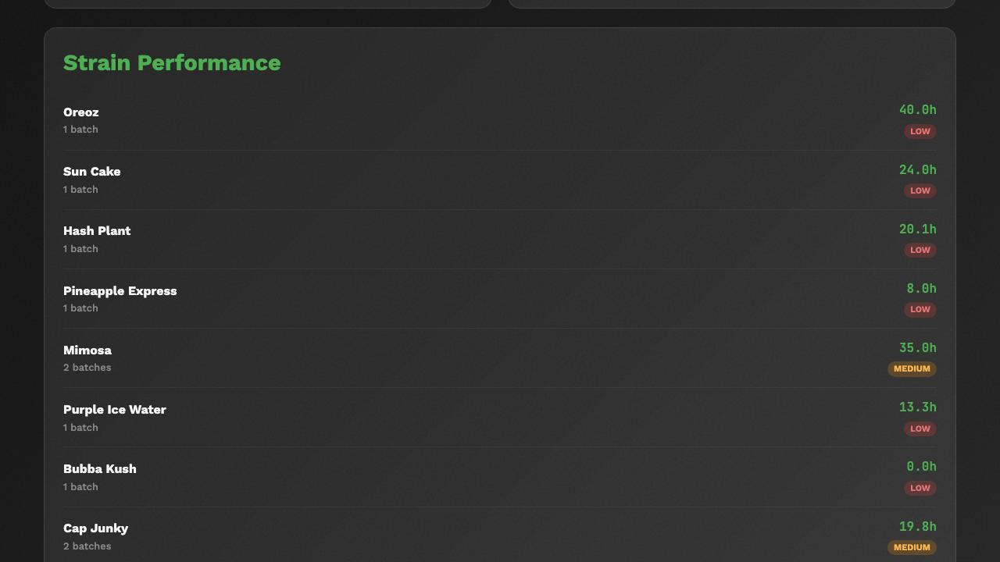
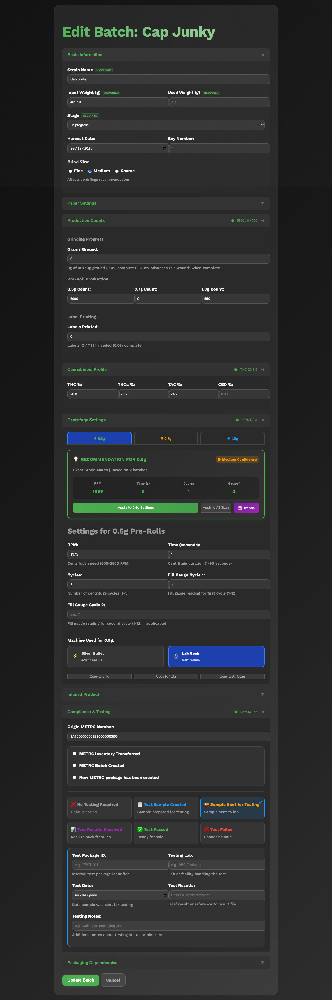

# Reporting and Statistics Guide

This guide explains how to read reports, view statistics, and understand the production data in PreRollTracker. You do not need to create reports yourself -- the system generates them for you. You just need to know where to look and what the numbers mean.

---

## Reading the Stats Page (Charts and Numbers)

The Stats page (also called Analytics) shows a visual overview of your production over time. It includes charts, graphs, and summary numbers.

### Getting to the Stats Page

1. From the **Production Dashboard**, look for the **Analytics** button in the navigation bar at the top. On a phone, tap the **menu button** (three horizontal lines) in the top-left corner and then tap **Analytics**.
2. Click or tap **Analytics**.

**What You'll See:** A page with a large title "Analytics" and several sections of charts and numbers below it.

### Understanding the Overview Section

At the top of the Stats page, you will see summary cards with key numbers:

- **Total Batches Completed** -- The total number of batches that have been fully processed and archived.
- **Total Pre-Rolls Produced** -- The grand total of all pre-rolls ever made, across all batches and all sizes.
- **Average Production Rate** -- The typical number of pre-rolls made per hour, averaged across all batches.
- **Active Batches** -- How many batches are currently being worked on right now.

### Understanding the Charts

The Stats page includes several charts:

#### Production Over Time
This chart shows how many pre-rolls were produced each day, week, or month. The horizontal axis (left to right) shows time. The vertical axis (bottom to top) shows the number of pre-rolls.
- **Higher bars or points** mean more production during that time period.
- **Dips** mean less production -- possibly due to fewer batches, days off, or slower work.

#### Production by Size
This chart breaks down production by pre-roll size (0.5g, 0.7g, 1.0g). It helps you see which sizes are made most often.
- Green typically represents 0.5g
- Blue typically represents 0.7g
- Orange typically represents 1.0g

#### Production Rate Trends
This chart shows how production speed (pre-rolls per hour) has changed over time. A rising trend means production is getting faster.

### Navigating the Stats Page
The Stats page may have buttons or tabs to switch between different views or time periods. Look for:
- **Time period selectors** -- Let you view data for the last week, month, or all time.
- **Size filters** -- Let you focus on just one pre-roll size.

### If Something Goes Wrong
- **The charts are empty** -- This usually means no batches have been completed yet, or the data has not been processed. If you have completed batches and still see empty charts, try refreshing the page.
- **The numbers don't look right** -- Check that all batches have had their counts updated correctly. Missing or incorrect counts will throw off the statistics.

---

## Understanding Production Rate Calculations

The production rate tells you how many pre-rolls are made per hour. Here is how the system calculates it:

### How It Works

1. The system records when a batch enters the **"In progress"** stage. This starts the timer.
2. As you update counts, the system tracks how many pre-rolls exist at each time point.
3. The rate is calculated as: **Total Pre-Rolls / Total Work Hours = Pre-Rolls Per Hour**
4. If the batch was paused (moved back to "Ground" and then returned to "In progress"), only the actual work time is counted. Break time is excluded.

### Example
- You started rolling at 8:00 AM.
- By 12:00 PM (4 hours later) you had made 480 pre-rolls.
- Your production rate = 480 / 4 = **120 pre-rolls per hour**.

### Rate Metrics Explained

On the Edit Batch page, you may see several rate numbers:

| Metric | What It Means |
|---|---|
| **Current Rate** | Your speed right now, based on the most recent counts |
| **Average Rate** | Your average speed across the entire batch |
| **Best Rate** | The fastest rate you achieved at any point during the batch |
| **Smoothed Rate** | A rate that filters out short-term fluctuations |
| **Trend** | Whether your rate is "increasing," "decreasing," or "stable" |

### If Something Goes Wrong
- **The rate says "N/A" or nothing** -- The batch must be at least in the "In progress" stage with some pre-rolls counted and some time elapsed.
- **The rate seems unrealistically high** -- This can happen if a large count was entered in a very short time (for example, if you forgot to update counts for several hours and then entered a big number all at once). The rate will average out over time.

---

## Viewing the Archive of Completed Batches

The Archive stores all batches that have been completed (moved to "Done" stage) and archived. This is your historical record.

### Getting to the Archive

1. From the **Production Dashboard**, click the **Archive** button in the navigation bar. On a phone, tap the **menu button** and then tap **Archive**.

**What You'll See:** A page listing all archived batches, with their strain name, production counts, dates, and other details.

### What You Can See in the Archive

For each archived batch, the Archive shows:
- **Strain name** and basic details
- **Total pre-rolls produced** by size (0.5g, 0.7g, 1.0g)
- **Production dates** (when the batch started and finished)
- **Production duration** (how long the batch took)
- **THC percentage** and other strain information
- **Centrifuge settings** that were used
- **Yield percentages** from weight checks

### Searching and Filtering the Archive

The Archive page may have a search bar or filter options:
- **Search** -- Type a strain name to find specific batches.
- **Sort** -- Click column headers to sort by strain name, date, or count.

### If Something Goes Wrong
- **A batch is missing from the Archive** -- The batch must be at the "Done" stage and then archived to appear here. If it is still on the main dashboard, it has not been archived yet.
- **The Archive is empty** -- No batches have been completed and archived yet.

---

## Checking Your Achievements

The Achievements page is a fun feature that recognizes production milestones and accomplishments.

### Getting to Achievements

1. From any page, navigate to the **Achievements** page. You may find it in the navigation bar or the mobile menu. Look for a button or link labeled **Achievements**.

**What You'll See:** A gallery of achievement badges organized by category. Some badges will be lit up (unlocked) and others will be dimmed (not yet earned).

[SCREENSHOT: The Achievements page showing unlocked and locked achievement badges]

### Achievement Categories

Achievements are grouped by how significant they are:

- **Apprentice tier (brown)** -- Entry-level achievements for getting started.
- **Professional tier (gray)** -- Mid-level achievements for consistent production.
- **Legend tier (gold)** -- Top-level achievements for outstanding production.

Each achievement also has a rarity level:
- **Common (gray)** -- Earned by most workers over time.
- **Rare (blue)** -- Takes notable effort to earn.
- **Epic (purple)** -- Impressive milestones that few achieve quickly.
- **Legendary (gold)** -- Extraordinary accomplishments.

### Examples of Achievements
- Producing your first 1,000 pre-rolls
- Completing a certain number of batches
- Maintaining a high production rate over time
- Rolling multiple sizes in a single batch

[SCREENSHOT: A close-up of one or two achievement badges showing their name, description, and rarity]

### If Something Goes Wrong
- **Achievements are not updating** -- Achievements are calculated based on completed batch data. Make sure batches are being properly recorded and archived.
- **All achievements are locked** -- You may need to complete and archive more batches for achievements to unlock.

---

## Understanding the Production Overview

The Production Dashboard itself serves as a real-time production overview. Here is how to read it effectively for reporting purposes:

### Quick Status Check

From the dashboard, you can quickly see:
- **How many batches are active** -- Count the rows or cards on the dashboard.
- **Which stage each batch is in** -- Look at the colored stage badges.
- **Total pre-rolls in progress** -- Add up the totals shown for each active batch.
- **What needs attention** -- Look for alert banners (orange for inventory, red for testing).

### Batch Detail for Reporting

For a detailed view of any batch:
1. Click or tap the batch on the dashboard.
2. The Edit Batch page shows all details including:
   - Strain information (THC %, harvest date, bay number)
   - Production counts by size
   - Centrifuge settings used
   - Weight measurements and yield
   - Production rate and timing
   - METRC tracking numbers
   - Testing status and notes

---

## Exporting or Viewing Audit History

The Audit page shows a complete history of every change ever made in the system. This is useful for tracking who changed what and when.

### Getting to the Audit Page

1. From the **Production Dashboard**, click the **Audit** button in the navigation bar. On a phone, tap the **menu button** and then tap **Audit**.

**What You'll See:** A list of entries showing every change, newest first. Each entry shows:
- **When** -- The date and time the change was made.
- **Batch** -- Which batch was affected.
- **What changed** -- The name of the field that was updated (for example, "counts_0_5" means the 0.5g count was changed).
- **Old value** -- What the field was before the change.
- **New value** -- What the field was changed to.

### Reading Audit Entries

Here are some common audit entries and what they mean:

| Field Name | What It Means |
|---|---|
| `counts_0_5` | The 0.5g pre-roll count was updated |
| `counts_0_7` | The 0.7g pre-roll count was updated |
| `counts_1_0` | The 1.0g pre-roll count was updated |
| `stage` | The batch stage was changed (for example, from 2 to 3 means "In progress" to "Finished") |
| `stage_auto_advanced` | The system automatically advanced the stage |
| `grams_ground` | The grams ground field was updated |
| `centrifuge_rpm` | Centrifuge RPM setting was recorded |
| `archived` | The batch was moved to the Archive |

### Using Audit Data

The audit trail is important for:
- **Quality assurance** -- Verifying that counts and stages were updated correctly.
- **Troubleshooting** -- Finding out when and why a number changed if something looks off.
- **Compliance** -- Having a record of all production data changes for regulatory purposes.

### If Something Goes Wrong
- **The audit page is slow to load** -- If there are thousands of entries, the page may take a moment. Wait for it to finish loading.
- **I can't find a specific change** -- The audit shows entries newest first. Scroll down to find older changes. There is no search feature on the audit page, so you may need to scroll through the list.

---

## Summary

You now know how to:

- Navigate to and read the Stats/Analytics page
- Understand production rate calculations
- View completed batches in the Archive
- Check your Achievements
- Use the Production Dashboard as a quick overview
- Read the Audit trail to see the history of changes

For information about managing paper, cone, and finished goods inventory, see the **Managing Inventory Guide**.
